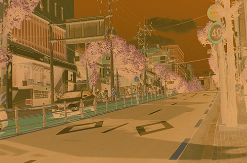
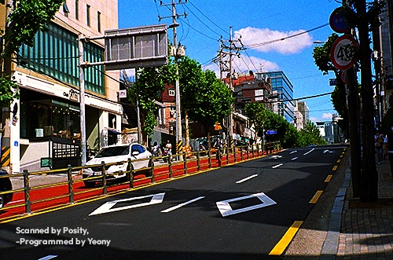
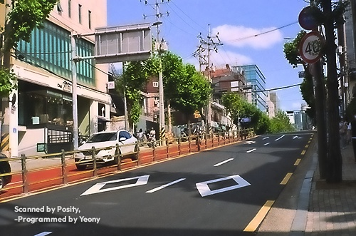
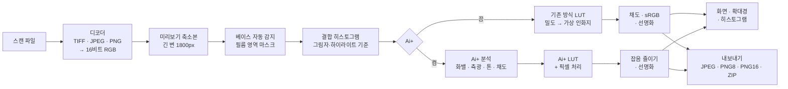
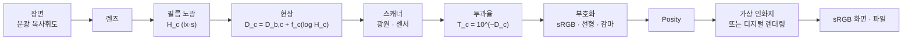

# 🎞️ Posity

디시인사이드 유저는 사용을 금하며, 이는 라이선스로, 법적 효력을 갖습니다.
위반 시, 디시인사이드 내 IP와 비교하여 법적 형사 고소를 가할 것입니다.

컬러 네거티브 필름 스캔을 브라우저에서 바로 사진으로 바꾸는, 파일 하나짜리 도구입니다.
설치할 것도, 올릴 곳도 없습니다. `posity.html` 하나를 브라우저로 열면 됩니다.

<https://scan.yeon.at/posity.html>

현재 버전 **v2.9.1** · 바뀐 점은 [12. 변경 기록](#12-변경-기록)에 있습니다. 도구 화면 왼쪽 위 제목 옆에도 버전이 표시됩니다. v2.8.3까지의 이름은 '네거티브 인화기', v2.9.0까지의 파일 이름은 `negative-printer.html`이었고, 예전 주소로 들어오면 새 주소로 넘어갑니다.

**목차**

1. [쉽게 알아보기](#1-쉽게-알아보기)
2. [원리](#2-원리)
3. [작동 방식](#3-작동-방식)
4. [알고리즘과 수식](#4-알고리즘과-수식)
5. [물리 세계](#5-물리-세계)
6. [체계](#6-체계)
7. [이슈와 해결](#7-이슈와-해결)
8. [최적화](#8-최적화)
9. [검증](#9-검증)
10. [특장점](#10-특장점)
11. [한계](#11-한계)
12. [변경 기록](#12-변경-기록)

---

## 1. 쉽게 알아보기

### 이 도구는 무엇인가요

필름 카메라로 찍은 컬러 필름을 현상하면, 밝은 곳은 어둡고 어두운 곳은 밝으며 색도 거꾸로 된 주황빛 그림이 나옵니다. 이것을 네거티브라고 부릅니다. 스캐너로 필름을 읽으면 컴퓨터에도 이 뒤집힌 주황빛 그림이 그대로 들어옵니다.

Posity는 이 그림을 우리가 아는 평범한 사진으로 되돌려 줍니다. 예전에 사진관에서 필름을 종이에 뽑던 일을 브라우저 안에서 하는 셈입니다.

### 이런 점이 좋아요

- **설치할 것이 없습니다.** 파일 하나를 브라우저로 열면 끝입니다.
- **사진이 밖으로 나가지 않습니다.** 모든 계산을 내 컴퓨터 안에서 하고, 어디에도 올리지 않습니다.
- **알아서 맞춰 줍니다.** 필름의 주황빛, 밝기, 색 균형을 스스로 찾아 맞춥니다.
- **여러 장을 한 번에** 넣고, 한 번에 저장할 수 있습니다.
- **섬세하게 저장합니다.** 스캔에 담긴 고운 색 단계를 그대로 살린 파일로도 저장할 수 있습니다.

### 사용 방법

1. `posity.html`을 크롬, 엣지, 사파리, 파이어폭스 같은 브라우저로 엽니다.
2. **스캔 열기**를 누르거나 파일을 화면에 끌어다 놓습니다. 여러 장을 한꺼번에 넣어도 되고, 폴더를 통째로 끌어다 놓으면 안쪽(하위 폴더 포함)의 이미지를 모두 넣습니다. 이미 넣은 파일은 다시 넣어도 건너뜁니다.
3. 잠시 기다리면 사진으로 바뀐 모습이 나타납니다.
4. 필요하면 자르기, 돌리기, 밝기와 색을 손봅니다. 왼쪽 필름 띠에서 다른 사진을 고르거나 ← → 키로 넘길 수 있습니다. 필름 띠의 썸네일은 파일을 넣으면 뒤에서 한 장씩 변환해 채워집니다. 필요 없는 컷은 썸네일 오른쪽 위의 × 로 목록에서 뺄 수 있고, 알림의 **되돌리기**로 다시 넣습니다.
5. **내보내기**로 지금 사진을, **전체 ZIP**으로 모든 사진을 한꺼번에 저장합니다. 저장한 사진의 왼쪽 아래, 가장자리에서 조금 안쪽에 "Scanned by Posity, -Programmed by Yeony" 워터마크가 두 줄로 새겨지고, 화면에서도 같은 자리에 보입니다. 전체 ZIP은 도중에 **취소**하면 그때까지 변환한 사진만 담아 저장합니다. Ai+ 켜짐, 저장 형식, JPEG 품질은 다음에 열 때도 그대로입니다.

N 키를 누르고 있으면 원래 필름 모습을 잠깐 볼 수 있고, 1:1 확대경으로 세부를 살펴볼 수 있습니다.

### Ai+ 버튼

Ai+를 켜면 필름 사진을 **디지털카메라로 찍은 사진처럼** 다듬어 줍니다. 바랜 곳 없이 맑고, 흰색은 깨끗하고, 색은 살짝 더 산뜻해지며, 필름 특유의 자글자글한 알갱이도 줄어듭니다. 어떤 보정을 했는지는 버튼 아래에 짧게 알려 줍니다.

모든 사진에 잘 맞는다고 약속할 수는 없습니다. 마음에 들지 않으면 Ai+를 끄거나, 그 사진만 원래 방식으로 되돌릴 수 있습니다.

### 예시

벚꽃이 핀 맑은 날의 거리를 찍은 컬러 네거티브 스캔입니다(500 × 331 px, 8비트 JPEG). 아무 설정도 건드리지 않고 파일만 넣어 두 방식으로 변환했습니다(v2.9.1, 왼쪽 아래는 워터마크).

<p align="center"></p>
<p align="center"><sub>스캔한 네거티브 원본. 필름 바탕의 주황빛(마스크)이 전체에 깔려 있습니다.</sub></p>

| 기본 방식 | Ai+ |
|:---:|:---:|
|  |  |

**기본 방식**은 사진관 인화지처럼 대비가 강하고 쨍합니다. 하늘은 짙은 파랑이고, 붉은 자전거 도로와 초록 가로수가 선명합니다. 그 대신 가장 어두운 곳과 가장 밝은 곳이 잘려, 햇빛 받은 아스팔트와 그늘이 거의 까맣게 뭉개지고 흰 건물 벽 일부가 하얗게 날아갔습니다.

**Ai+**는 버튼 아래에 "보정 · 밝기 +1.7EV · 채도 +39% · 그레인 줄임"이라고 알려 줍니다. 아스팔트나 보도 같은 회색이 이미 치우침 없이 회색이라 색은 고치지 않았고, 기본 방식이 너무 어둡게 누른 중간 밝기를 1.7스톱 올렸으며, 스캔의 옅은 색에 채도를 더하고 필름 알갱이를 줄였습니다. 그래서 아스팔트의 결, 그늘 속 보도블록, 흰 차의 모양이 살아 있으면서도 그림자는 충분히 짙고, 까맣게 뭉개진 곳은 거의 없습니다(기본 방식 19%, Ai+ 1%). 하늘은 기본 방식보다 조금 밝고 연한 파랑입니다.

어느 쪽이 정답이라기보다 쓰임새의 차이입니다. 강하고 쨍한 인화 느낌이 좋으면 기본 방식을, 그늘과 밝은 곳의 세부까지 남긴 디지털 사진 같은 결과가 좋으면 Ai+를 쓰세요. 두 방식 모두 슬라이더로 다듬을 수 있습니다. Ai+에서 **블랙 포인트**를 올리면 그림자가 더 깊어지고, 기본 방식에서는 **노출**을 +0.9 EV쯤 올리면 이 사진의 뭉개진 그늘이 살아납니다. 이 예시의 측정값은 [9. 검증](#9-검증)의 '실제 스캔 예시'에 있습니다.

### 알아 두면 좋은 것

필름 가장자리의 주황색 여백이 조금 보이게 스캔하면 색을 더 정확하게 찾습니다. 스캐너가 만든 TIFF, JPEG, PNG 파일을 열 수 있고, 카메라 원본(RAW) 파일은 열지 못합니다. 2억 화소가 넘는 아주 큰 파일은 브라우저 메모리 때문에 열지 못합니다. 인터넷이 없어도 쓸 수 있으며, 그때는 글꼴만 기본 글꼴로 바뀝니다.

---

## 2. 원리

### 2.1 컬러 네거티브 필름은 어떻게 기록하나

컬러 네거티브 필름에는 파랑, 초록, 빨강 빛에 각각 반응하는 세 감광층이 있습니다. 빛을 받은 층에서는 현상할 때 그 빛의 보색 염료(노랑, 마젠타, 시안)가 생기고, 빛을 많이 받을수록 염료가 짙어집니다. 그래서 필름에는 밝기와 색이 모두 뒤집힌 그림이 남습니다.

실제 염료는 이상적이지 않습니다. 마젠타 염료는 초록빛만 막아야 하지만 파란빛도 조금 막고, 시안 염료는 빨간빛 말고도 초록·파란빛을 조금 막습니다. 이 '원치 않는 흡수'를 상쇄하려고, 필름은 염료가 덜 생긴 곳에 노랑·분홍빛을 띤 마스킹 커플러를 남겨 둡니다. 염료가 생긴 만큼 마스크 색은 사라지므로, 원치 않는 흡수와 마스크를 더하면 노광량과 상관없이 **어디서나 같은 양**이 됩니다. 필름 전체에 깔린 균일한 주황색의 정체가 이것이며, 여기에 필름 베이스와 현상 흐림(포그)의 농도가 더해집니다.

### 2.2 밀도와 특성곡선

필름이 빛을 얼마나 통과시키는지를 투과율 $`T`$ 로, 얼마나 막는지를 밀도 $`D = -\log_{10} T`$ 로 나타냅니다. 밀도는 로그라서 곱셈이 덧셈이 됩니다. 필름 두 겹을 겹치면 밀도가 더해지고, 노출을 두 배로 늘리면 밀도가 일정량 늘어납니다.

노출의 로그에 대한 밀도의 관계를 특성곡선(H&D 곡선)이라 하며, 가운데는 거의 직선이고 양 끝(토와 숄더)은 눕습니다. 직선부의 기울기를 감마 $`\gamma`$ 라 하고, 컬러 네거티브는 보통 0.6 안팎입니다. 장면이 한 스톱(두 배) 밝아지면 밀도는 $`0.6 \times \log_{10} 2 \approx 0.18`$ 만큼 짙어집니다. 그래서 이 도구는 모든 계산을 **밀도, 즉 로그 공간**에서 합니다. 노출 차이는 평행 이동이 되고, 균일한 주황 마스크는 채널마다 더해진 상수가 되어 뺄셈 한 번으로 사라집니다.

### 2.3 주황색 빼기와 반전

노광되지 않은 필름(베이스)의 투과율을 $`T_b`$ 라 하면, 화상의 각 점을 $`T_b`$ 로 나눈 값 $`T/T_b`$ 에는 마스크와 베이스·포그가 모두 빠진 순수한 화상 밀도만 남습니다. 흔히 쓰는 '색 반전 후 주황색 빼기'는 이 나눗셈을 감마가 걸린 값이나 선형 반전으로 흉내 내는 것이라, 밝기에 따라 다르게 틀어지는 색이 남습니다. 이 도구는 스캔 값을 선형 투과율로 되돌린 뒤 정확히 나눕니다.

### 2.4 세 채널의 균형

세 감광층의 감마는 서로 조금씩 다르고, 스캐너의 광원과 센서도 채널마다 다릅니다. 그래서 같은 장면 범위가 채널마다 다른 밀도 범위로 기록됩니다. 이 도구는 화상에서 가장 얇은 부분(그림자 기준)과 가장 짙은 부분(하이라이트 기준)을 찾아, 각 채널의 밀도 범위를 0에서 1로 맞춥니다.

이때 기준점은 **세 채널이 같은 픽셀 무리**를 보도록 고릅니다. 채널마다 따로 극단값을 고르면, 예를 들어 파란 하늘의 가장 짙은 부분과 흰 벽의 가장 짙은 부분이 섞여 기준 자체의 색이 틀어지기 때문입니다. '채널별' 방식은 층별 감마 차이를 이렇게 보정하고, '연동' 방식은 세 채널에 같은 범위를 써서 필름 고유의 발색을 남깁니다.

### 2.5 가상 인화지 (기존 방식)

사진관의 인화는 네거티브를 인화지에 비추는 일이고, 인화지에도 S자 모양의 특성곡선과 최대 농도가 있습니다. 기존 방식은 이 인화지를 흉내 냅니다. 정규화한 로그 노출에 인화지 곡선을 걸어 반사율을 얻으므로, 노출과 색온도·색조 슬라이더는 확대기의 노출 시간과 컬러 필터처럼 로그 노출을 옮기는 조작이 됩니다. 결과는 필름을 종이에 뽑은 사진의 느낌입니다.

### 2.6 Ai+: 인화지 대신 디지털카메라처럼

Ai+는 2.3과 2.4의 필름 해석은 그대로 두고, 마지막 인화지 단계만 **디지털카메라의 렌더링**으로 바꿉니다. 인화지 곡선은 채널마다 따로 걸리기 때문에, 밝은 색(하늘)은 세 채널이 함께 위쪽 어깨로 몰려 색이 바래고, 그림자 색은 채널 차이가 벌어져 지나치게 짙어집니다. 디지털카메라는 밝기에 곡선을 걸고 색의 비율은 지킵니다.

Ai+는 여섯 가지 생각으로 이루어집니다. 밝기마다 회색에 남은 색 틀어짐을 찾아 빼는 **화이트밸런스**, 장면의 대표 밝기를 재서 맞추는 **측광**, 밝기에만 거는 **S자 톤 곡선**, 흐린 색을 더 살리는 **바이브런스와 채도 평준화**, 중간 크기 대비를 키우고 그레인을 줄이는 **맑게**, 잡음보다 큰 윤곽만 세우는 **선명화**입니다. 신경망이 아니라 화상 통계에 기반한 계산이며, 모두 브라우저 안에서 합니다.

---

## 3. 작동 방식

### 3.1 전체 흐름



### 3.2 불러오기

TIFF는 자체 디코더로 읽습니다. 8·16비트 정수와 32비트 실수, 무압축·LZW·Deflate·PackBits 압축, 스트립·타일 배치, 청크·플래너 배열을 지원합니다. JPEG와 PNG는 브라우저의 디코더로 읽으므로 8비트입니다. 모든 입력은 채널당 16비트 정수 배열로 통일합니다.

원본과 별도로 긴 변 1800px의 미리보기 축소본을 만들어 분석과 화면에 쓰고, 원본 해상도 계산은 1:1 확대경과 저장할 때만 합니다. 원본은 2억 화소까지 받습니다. 16비트 RGB로 약 1.2GB이며, 그보다 크면 브라우저 메모리 한도에 걸립니다.

### 3.3 필름과 베이스 찾기

**베이스 자동 감지**는 주황색 순서($`R \ge G \ge B`$)를 만족하는 픽셀 가운데 가장 밝은 0.3%(최소 50개)의 평균입니다. 노광되지 않은 필름이 빛을 가장 많이 통과시키기 때문입니다. 스캐너 클리핑(코드값 98.5% 이상)은 제외하며, 주황색 픽셀이 500개와 전체의 2% 중 큰 값보다 적으면 색 조건 없이 다시 찾습니다.

**필름 영역 마스크**는 베이스 대비 밀도로 픽셀을 세 종류로 나눕니다.

| 종류 | 조건 | 의미 |
|---|---|---|
| 필름 밖 | 클리핑, 평균 밀도가 베이스보다 2.4 이상 짙음, 또는 세 채널 모두 베이스보다 0.03 이상 얇음 | 홀더, 마스크, 필름 사이 빈틈과 퍼포레이션으로 새는 빛 |
| 베이스 같음 | 세 채널 모두 베이스와 ±0.1 이내 | 프레임 사이 여백 (자동 맞춤과 Ai+ 통계에 씀) |
| 화상 | 그 밖 | 통계에 쓰는 픽셀 |

마스크에서 필름 테두리를 찾아 통계 영역을 좁히고, 자르기의 자동 맞춤에도 씁니다. 그 안에서 '분석 제외 테두리'(기본 3%)만큼을 한 번 더 뺍니다.

### 3.4 그림자·하이라이트 기준 찾기

그레인 한 알이 극단값을 정하지 않도록, 먼저 화상 픽셀의 세 채널 평균 로그 투과율을 5×5 이웃으로 평균한 **순위 지도**를 만듭니다. 이 순위로 로그 투과율 −6에서 0까지를 0.001 간격(6,144칸)으로 나눈 **결합 히스토그램**을 쌓되, 칸마다 세 채널의 선형 투과율 합도 함께 누적합니다.

가장 얇은 쪽 꼬리(그림자 클리핑, 기본 0.1%)와 가장 짙은 쪽 꼬리(하이라이트 클리핑, 기본 0.1%)에서 필요한 픽셀 수만큼을 모으고, 마지막 칸은 필요한 비율만큼만 더합니다. 그 무리의 채널별 평균 투과율이 그림자 기준과 하이라이트 기준이 됩니다. 통계에서 필름이 아닌 픽셀을 뺐더니 5%도 남지 않으면(베이스 오인 등) 제외 없이 다시 계산합니다.

### 3.5 변환표 (LUT)

슬라이더를 움직일 때마다 채널마다 65,536칸짜리 변환표를 새로 만듭니다. 칸 번호가 16비트 스캔 값이고, 칸의 내용은 그 값의 최종 선형 출력입니다. 픽셀 처리는 채널당 표 조회 한 번과 몇 번의 곱셈뿐이라, 슬라이더에 즉시 반응합니다.

### 3.6 마무리와 저장

기존 방식은 표에서 얻은 선형 값에 휘도를 보존하는 채도를 걸고, sRGB로 부호화한 뒤, 밝기에만 언샤프 마스크를 겁니다(기본 양 50%, 원본 기준 반경 1.0px, 노이즈 임계값 1%). 미리보기에서는 반경을 화면 배율에 맞추고, 0.35px보다 작아지면 선명화를 생략합니다.

저장은 128행 띠 단위로 합니다. 띠마다 주변을 더 처리한 뒤 잘라내므로, 이웃을 보는 선명화와 잡음 줄이기도 띠 경계에서 이음새 없이 한 번에 처리한 것과 같습니다. 형식은 다음과 같습니다.

| 형식 | 방식 |
|---|---|
| JPEG (8비트) | 캔버스 인코더, 품질 92 / 95(기본) / 100 선택 |
| PNG (8비트) | 캔버스 인코더 |
| PNG (16비트) | 자체 인코더 (`CompressionStream`의 Deflate) |
| 전체 ZIP | 자체 ZIP 작성기(무압축 저장), 1.8GB마다 나눔. 취소하면 현재 프레임까지 마치고 그때까지의 ZIP을 저장 |

**워터마크.** 모든 저장 결과(JPEG, PNG8, PNG16, 전체 ZIP)의 왼쪽 아래에 두 줄로 새깁니다.

```
Scanned by Posity,
-Programmed by Yeony
```

자르기·회전을 마친 최종 화상에 새기므로 이 도구의 자르기로는 지워지지 않고, 가장자리에서 짧은 변의 6%만큼 안쪽에 두어 다른 프로그램에서 잘라 내려면 사진 가장자리까지 함께 잃게 됩니다. 글자 크기는 짧은 변의 2.5%(최소 11px), 줄 간격은 글자 크기의 1.25배이고, 흰 글자(불투명도 85%)에 옅은 검은 그림자를 둘러 밝은 곳과 어두운 곳 모두에서 읽힙니다. 글꼴은 기하학적인 현대 산세리프인 Outfit의 굵은체(700)입니다. 워터마크에 쓰는 글자만 담은 작은 파일을 Google Fonts에서 받고, 받지 못하면(오프라인 등) 시스템의 굵은 산세리프(Helvetica Neue, Arial 등)로 그립니다. 저장할 때는 글꼴이 준비될 때까지 최대 1.5초 기다려 화면과 같은 글꼴로 새깁니다. 워터마크 자리만 작은 캔버스에 그려 색과 불투명도를 읽은 뒤 128행 띠를 처리할 때 실수 버퍼에 섞으므로(캔버스와 같은 '위에 덮기', 부호화 공간), 8비트와 16비트 저장이 같은 워터마크를 갖습니다. 화면에서는 저장될 영역(자르는 중이면 자르기 사각형)의 왼쪽 아래에 같은 비율로 그리고, 원본 보기·베이스 찍기 중에는 그리지 않습니다. 필름 띠 썸네일과 1:1 확대경에는 넣지 않습니다.

파일 이름은 `원래이름_positive.jpg`이고, Ai+를 적용한 프레임은 `원래이름_positive_ai.jpg`입니다. ZIP은 `positives.zip`이며, 나뉘면 `positives_1.zip`, `positives_2.zip`…이 됩니다. 브라우저의 일반 다운로드로 저장됩니다.

### 3.7 편집 도구

| 도구 | 동작 |
|---|---|
| ↺ 90° / ↻ 90° / 좌우 반전 | 방향 바꾸기 |
| 자르기 | 손잡이로 변·모서리 끌기, 안쪽 끌어 옮기기. 비율: 자유, 3:2(135, 6×9), 4:3(6×4.5), 1:1(6×6), 5:4(6×7), 65:24(파노라마). 자동 맞춤은 필름 테두리 안쪽에 비율을 맞춰 가운데 정렬 |
| 베이스 찍기 | 찍은 점 7×7 평균을 베이스로 지정하고, 검은점 기준을 '필름 베이스'로 바꿈(Ai+가 켜져 있는 동안은 베이스만 쓰이고 검은점 기준은 자동 고정) |
| 회색 찍기 | 찍은 점 5×5를 무채색으로 만드는 색온도·색조를 계산 |
| 원본 보기 | 버튼이나 N 키(한글 자판의 ㅜ도)를 누르고 있는 동안 스캔 원본을 보여 줌 |
| 1:1 확대경 | 원본 해상도로 처리한 220×220px 영역 |
| 히스토그램 | 결과의 RGB 분포 |
| 보정 초기화 | 보정값만 기본으로. 자르기·회전·반전과 Ai+ 예외는 유지 |
| 모든 프레임에 적용 | 자르기·회전·반전과 Ai+ 예외를 뺀 설정을 모든 프레임에 복사하고, 그 프레임들의 썸네일을 곧바로 다시 만듦 |
| 목록에서 빼기 | 필름 띠 썸네일의 × (마우스를 올리면 보임, 터치 기기에서는 항상 보임). 설정째 들고 있다가 알림의 '되돌리기'로 제자리에 되돌림. 뺀 프레임은 전체 ZIP에서도 빠짐 |

설정은 프레임마다 따로 저장되며, 편집한 프레임이 있으면 새로고침·창 닫기 전에 브라우저가 확인을 묻습니다. 키보드는 ← → 또는 PageUp·PageDown으로 이전·다음 프레임, Home·End로 처음·마지막 프레임, Esc로 도구 해제, 자르기 중 Enter로 자르기 완료입니다. 슬라이더에 포커스가 있을 때의 ← → 는 슬라이더 값을 바꿉니다. 필름 띠에서 읽을 수 없는 파일은 '읽을 수 없음'으로 표시되고, 마우스를 올리면 이유가 보입니다. 입력 선택지와 슬라이더는 다음과 같습니다.

| 항목 | 선택지 또는 범위 | 기본 |
|---|---|---|
| 스캔 인코딩 | sRGB 감마 / 선형(RAW에서 뽑은 선형 TIFF) / 감마 2.2 | sRGB |
| 검은점 기준 | 자동(그림자 백분위) / 필름 베이스(무노광 = 검정) | 자동 |
| 채널 정규화 | 채널별(층별 감마 차이 보정) / 연동(필름 고유 발색 유지) | 채널별 |
| 노출 | −3 … +3 EV | 0 |
| 대비 | 0.5 … 2× | 1 |
| 블랙 포인트 / 화이트 포인트 | −20 … +30% / −30 … +20% | 0 |
| 색온도 / 색조 | −2 … +2 (채널별 인화 노출 스톱) | 0 |
| 채도 | 0 … 200% | 100% |
| 선명도: 양 / 반경 / 노이즈 임계값 | 0 … 300% / 0.4 … 4px / 0 … 5% | 50% / 1.0px / 1% |
| 그림자·하이라이트 클리핑 | 0 … 2% | 0.1% |
| 분석 제외 테두리 | 0 … 20% | 3% |

### 3.8 Ai+가 켜졌을 때

Ai+는 프레임을 열거나 분석 설정이 바뀔 때 한 번 분석하고(큰 스캔 기준 약 0.4~0.5초), 그 결과로 변환표를 만듭니다. 순서는 다음과 같습니다.

1. 기존 방식을 슬라이더 중립으로 만듭니다. 검은점 기준과 채널 정규화는 권장값(자동, 채널별)으로 고정하고, 그 두 선택지는 잠급니다.
2. 정규화한 로그 노출을 선형 빛으로 바꾼 **분석 지도**(긴 변 768px)를 만듭니다. 필름 영역과 분석 설정이 그대로면 다시 쓰고, 바뀌면 새로 만듭니다.
3. 자르기와 테두리 여백 안의 필름 픽셀을 통계 대상으로 고릅니다. 프레임 사이 여백 같은 베이스 픽셀은 빼되, 야경처럼 그런 픽셀이 대부분이면 둡니다.
4. 화이트밸런스(밝기 구간마다 무채색 후보를 모아 합의한 밝기별 캐스트), 측광, 톤 곡선, 채도 목표, 국소 대비 지도를 차례로 구합니다.
5. 첫 렌더링 때 원본 해상도의 가운데와 네 사분면 중심, 256×256 블록 다섯 곳에서 그레인을 잽니다.
6. 픽셀마다 톤, 색, 국소 대비를 적용하고, 원본 해상도(또는 0.6배 이상 미리보기)에서는 잡음 줄이기와 선명화를 합니다.

Ai+가 켜져 있으면 톤·색 슬라이더는 **Ai+ 결과 위에 더하는 미세 조정**이 됩니다. 모두 0이면 Ai+ 결과 그대로입니다. 패널의 보정 설명에서 '화밸 보정(색온도 −0.22, 색조 +0.08 상당)'처럼 괄호 안 값은 가운데 밝기에서 뺀 색 틀어짐을 색온도·색조 슬라이더 단위로 환산한 양이라, 형광등 아래 베이지 벽처럼 화밸이 지나쳤을 때 슬라이더를 반대로 그만큼 움직이면 되돌아갑니다.

| 슬라이더 | Ai+에서의 의미 |
|---|---|
| 노출 | 톤 곡선에 들어가기 전 밝기를 스톱 단위로 옮김 |
| 대비 | 곡선의 두 기울기에 곱함 |
| 블랙 포인트 | 그림자 깊이. 키 아래 곡선 기울기에만 배율 $`2^{1.5 p_b}`$ (+쪽) / $`2^{2.5 p_b}`$ (−쪽)을 걸고 키 근처에서 부드럽게 1로 이음. 중간 밝기와 흰색은 그대로 |
| 화이트 포인트 | 곡선 상한 $`W = 1 - 0.5 \times \text{값}`$ (0.85…1.25) |
| 색온도 / 색조 | Ai+ 화이트밸런스 뒤 채널별 로그 오프셋 |
| 채도 | Ai+가 정한 채도 배율에 곱함 |
| 선명도 | 양 ×1.5, 임계값은 남은 그레인에 맞춰 자동으로 올림 |

버튼 아래의 보정 설명은 실제로 한 일만 보여 줍니다. **화밸 보정**(따뜻함 일부 유지), **밝기 ±xEV**(같은 계측 지점의 기존 방식 밝기와 비교), **밝은 장면 유지 / 어두운 장면 유지**(장면 키를 따름), **안개 걷기**, **명암 압축**, **채도 ±x%**, **그레인 줄임**이 있습니다. '이 프레임만 기존 방식으로'를 체크하면 그 프레임만 Ai+를 끕니다.

---

## 4. 알고리즘과 수식

아래 기호에서 $`c \in \{R, G, B\}`$ 는 채널이고, 휘도 가중치는 $`w = (0.2126,\ 0.7152,\ 0.0722)`$ (sRGB/Rec.709)입니다.

### 4.1 스캔 값 → 투과율

16비트 코드 $`v`$ 를 선형 투과율로 되돌립니다.

```math
T = \mathrm{dec}\!\left(\frac{v}{65535}\right),\qquad
\mathrm{dec}_{\mathrm{sRGB}}(u) =
\begin{cases}
u / 12.92 & u \le 0.04045 \\[2pt]
\left(\dfrac{u + 0.055}{1.055}\right)^{2.4} & \text{그 밖}
\end{cases}
```

선형 인코딩은 $`\mathrm{dec}(u) = u`$, 감마 2.2는 $`\mathrm{dec}(u) = u^{2.2}`$ 입니다. 로그 투과율 $`\log_{10} T`$ 는 65,536칸 표로 미리 계산해 둡니다.

### 4.2 기존 방식

**베이스 대비 밀도.** $`T_{b,c}`$ 는 베이스 투과율입니다.

```math
D_c = \log_{10} T_{b,c} - \log_{10} T_c
```

**기준 밀도.** 3.4의 꼬리 무리의 채널별 평균 투과율을 $`\bar T^{\,\mathrm{dense}}_c`$ (가장 짙은 쪽), $`\bar T^{\,\mathrm{thin}}_c`$ (가장 얇은 쪽)라 합니다.

```math
D^{\mathrm{hi}}_c = \log_{10} T_{b,c} - \log_{10} \bar T^{\,\mathrm{dense}}_c,\qquad
D^{\mathrm{lo}}_c =
\begin{cases}
\log_{10} T_{b,c} - \log_{10} \bar T^{\,\mathrm{thin}}_c & \text{자동} \\
0 & \text{필름 베이스}
\end{cases}
```

```math
r_c = \max\!\left(D^{\mathrm{hi}}_c - D^{\mathrm{lo}}_c,\ 0.05\right),\qquad
r_c \leftarrow \tfrac{1}{3}\textstyle\sum_k r_k\ \ (\text{연동})
```

**장면 범위(스톱).** 필름 감마를 $`\gamma_{\mathrm{film}} = 0.6`$ 로 가정합니다. EV 단위를 환산하는 데만 씁니다.

```math
S = \frac{r_G}{\gamma_{\mathrm{film}} \log_{10} 2}
```

**정규화 로그 노출과 사용자 조작.** 노출 $`E`$(스톱), 색온도 $`t`$, 색조 $`m`$, 블랙 포인트 $`p_b`$, 화이트 포인트 $`p_w`$ 에 대해 다음과 같습니다.

```math
x_c = \left(\frac{D_c - D^{\mathrm{lo}}_c}{r_c} + \frac{k_c + E}{S} - p_b\right)\frac{1}{1 + p_w - p_b},
\qquad
k = \left(t + \tfrac{m}{2},\ -m,\ -t + \tfrac{m}{2}\right)
```

색온도 축 $`(1, 0, -1)`$ 과 색조 축 $`(\tfrac12, -1, \tfrac12)`$ 은 둘 다 $`(1,1,1)`$ 과 직교하므로, 색을 바꿔도 전체 밝기는 변하지 않습니다.

**가상 인화지.** 최대 농도 $`D_{\max} = 2.4`$, 기울기 $`g = 5 \times \text{대비}`$, 중심 $`x_0 = 0.5`$ 입니다.

```math
D_p(x) = \frac{D_{\max}}{1 + e^{\,g (x - x_0)}},\qquad
R(x) = 10^{-D_p(x)},\qquad
y_c = \max\!\left(0,\ \frac{R(x_c) - R(0)}{R(1) - R(0)}\right)
```

중간 기울기는 $`D_{\max}\, g / 4 = 3.0`$(정규화 단위당 밀도)입니다. 장면 범위가 8스톱이면 스톱당 약 0.38 밀도이고, 반사율 기준 전체 감마는 약 1.25로 실제 인화의 대비와 비슷합니다.

**채도(휘도 보존)와 부호화.** $`s = \text{채도} \times 1.1`$ 입니다.

```math
Y = \sum_c w_c\, y_c,\qquad y'_c = Y + s\,(y_c - Y)
```

값을 $`[0,1]`$ 로 자른 뒤 sRGB로 부호화합니다.

**선명화(언샤프 마스크, 부드러운 문턱).** $`Y'`$ 는 부호화된 휘도, $`G_\sigma`$ 는 가우시안, $`a`$ 는 양, $`\theta`$ 는 노이즈 임계값입니다.

```math
d = Y' - G_\sigma * Y',\qquad
d' = a\, d\, \min\!\left(1, \frac{\lvert d\rvert}{\theta}\right),\qquad
c'' = c' + d'
```

$`\lvert d\rvert < \theta`$ 인 잔물결은 $`a\,d\lvert d\rvert/\theta`$ 로 약하게만 키워, 그레인이 거칠어지지 않습니다.

**회색 스포이트.** 찍은 5×5 영역의 사용자 색 보정 이전 로그 노출(스톱) $`\ell_c`$ 에 대해 다음과 같습니다.

```math
o_c = \bar\ell - \ell_c,\qquad
t = \frac{o_R - o_B}{2},\qquad
m = \frac{\tfrac12 o_R - o_G + \tfrac12 o_B}{1.5}
```

### 4.3 Ai+

**① 선형 빛.** 기존 방식(슬라이더 중립)의 정규화 로그 노출을 선형 빛으로 바꿉니다. 하이라이트 기준이 1, 그림자 기준이 $`2^{-S}`$ 입니다.

```math
x_c = \frac{D_c - D^{\mathrm{lo}}_c}{r_c},\qquad e_c = 2^{\,S (x_c - 1)}
```

채널별 정규화로 세 채널이 같은 스톱 범위를 갖게 되므로 모두 같은 $`S`$ 를 씁니다. 이는 층마다 감마를 $`\gamma_c = r_c / (S \log_{10} 2)`$ 로 추정해 되돌리는 것과 같습니다.

**② 로그와 색도.**

```math
\ell_c = \log_2(e_c + \varepsilon),\ \ \varepsilon = 5\times10^{-4},\qquad
\tau = \frac{\ell_R - \ell_B}{2},\qquad
\mu = \frac{\ell_R + \ell_B}{2} - \ell_G
```

$`\tau`$ 는 호박색–파랑 축, $`\mu`$ 는 마젠타–초록 축(단위: 스톱)입니다.

**③ 중성 후보.** 화밸 추정은 밝은 픽셀·회색 세계·회색 경계 같은 전역 통계로는 되지 않습니다. 세 방법 모두 선형값의 가장 밝은 부분에 지배되는데, 기존 방식의 채널별 정규화가 그곳(가장 짙은 0.1%)을 이미 중성으로 강제해 두어 추정치가 늘 0 근처로 나오기 때문입니다(7절). 대신 밝기 구간마다 '무채색일 법한 곳'을 찾습니다. 3×3 평균한 로그값의 색도 $`(\tau_i, \mu_i)`$ 와 휘도 $`L_i`$ 를 재고, $`[q_{1}, q_{99}]`$ 를 0.75스톱 폭의 구간 $`K`$ 개(4~10)로 나눕니다. 픽셀 가중은 다음과 같습니다.

```math
w_i = \exp\!\left(-\frac{\tau_i^2}{2\cdot 0.18^2} - \frac{\mu_i^2}{2\cdot 0.12^2}\right)\cdot
\big(0.7 + 0.3\min(1, t_i / 0.04)\big)
```

$`t_i`$ 는 3×3 평균 휘도와 9×9 평균 휘도의 차(결)로, 하늘처럼 매끈한 면은 조금 덜 봅니다. 구간마다 0.015스톱 칸의 색도 격자에 $`w_i`$ 를 더하되, 지도 위 16px 칸 안에서는 한 색도 칸에 24픽셀까지만 셉니다. 큰 단색 면(하늘, 나무, 잔디)이 표를 독차지하지 못하게 하는 장치입니다. 격자를 이항 커널로 두 번 흐려 봉우리를 찾고(격자 가장자리 2칸은 제외), 봉우리 ±0.045스톱 창 안의 가중 평균을 그 구간의 후보 $`(\tau_k, \mu_k)`$ 로 삼습니다. 구간 신뢰는

```math
c_k = \min\!\left(1, \frac{n^{\mathrm{cell}}_k}{8}\right)\cdot
\mathrm{clip}\left(\frac{d_k - 0.08}{0.32}, 0, 1\right)\cdot
\exp\!\left(-\frac{1}{4}\left(\frac{\tau_k^2}{2\cdot 0.18^2} + \frac{\mu_k^2}{2\cdot 0.12^2}\right)\right)
```

입니다. $`n^{\mathrm{cell}}_k`$ 는 창 안의 픽셀을 4개 이상 가진 칸 수(후보가 퍼진 정도), $`d_k`$ 는 구간의 가중 질량 가운데 창 안의 비율(후보의 점유율)이고, 마지막 항은 0에서 먼 후보(큰 유채색 면일 가능성)를 덜 믿는 사전입니다.

**④ 구간 간 합의.** 구간 값들을 밝기의 함수로 맞춥니다. $`z_k \in [-\tfrac12, \tfrac12]`$ 를 구간의 위치라 하면

```math
c(z) = p_0 + p_b\,(1 - 4z^2)
```

로, 상수와 가운데 굽음만 둡니다. 굽음은 층마다 특성곡선 모양이 달라 양 끝은 맞아도 중간 톤만 물드는 크로스오버를 담습니다. 기울기 항은 일부러 두지 않습니다. 양 끝은 기존 방식이 이미 중성으로 맞춰 둔 곳이라 그곳 후보(하늘, 전등)는 캐스트가 아닌 그 물체의 색이기 쉽고, 기울기를 허용하면 깨끗한 장면의 밝은 끝이 ±5 b* 만큼 기울었습니다(7절). 같은 이유로 구간 가중에 $`1 - \lvert 2z\rvert^{p}`$ 를 곱해 양 끝을 덜 봅니다(어두운 쪽 $`p = 6`$, 밝은 쪽 $`p = 2`$: 밝은 쪽이 발광체·하늘에 더 자주 차지됩니다). 적합은 Tukey 이중가중 IRLS 6회(척도 0.3스톱)로, 다른 구간과 동떨어진 구간은 버려집니다. 굽음 항에는 증거 합의 1%를 능형 안정화로 더합니다. 축(τ, μ)마다 따로 풉니다.

증거 $`E = \sum_k w^{\mathrm{fin}}_k \cdot \exp\!\big(-(\mathrm{rms}/0.1)^2\big)`$ 는 최종 가중의 합에 잔차의 일관성을 곱한 것이고, 신뢰는 $`\min(1, E/2)`$ 입니다. 여기에 장면 평균색과의 일치를 곱합니다. 중간 밝기 $`[q_{10}, q_{95}]`$ 픽셀의 로그 색도 평균 $`g`$ 가 후보 합의의 가운데 값 $`c(0)`$ 와 같은 방향으로 절반 이상이면 1, 반대 방향이면 0입니다. 나무나 잔디가 후보를 차지했을 때 장면 전체가 그 방향이 아니면 보정을 줄이는 안전장치입니다. 상수 항에는 0.03스톱의 소프트 문턱을 둡니다(큰 면이 기준 회색과 조금 어긋나 있을 때의 과보정을 막는 보험). 신뢰를 곱한 $`\tau(z), \mu(z)`$ 를 $`\pm 0.5, \pm 0.35`$ 스톱으로 한정하고, 가운데 값이 따뜻한 쪽이면 일부를 남깁니다.

```math
a =
\begin{cases}
\min\!\big(0.4,\ 0.4\,(\tau(0) - 0.2)\big) & \tau(0) > 0.2 \\
-\min\!\big(0.1,\ 0.1\,(-\tau(0) - 0.2)\big) & \tau(0) < -0.2 \\
0 & \text{그 밖}
\end{cases}
```

```math
o(z) = \left(\tau' + \tfrac{\mu}{3},\ -\tfrac{2\mu}{3},\ -\tau' + \tfrac{\mu}{3}\right),\quad \tau' = \tau(z) - a,
\qquad \tilde\ell_c = \ell_c - o_c\!\left(\frac{\ell_c - m}{s}\right)
```

$`m, s`$ 는 $`[q_1, q_{99}]`$ 의 가운데와 폭입니다. 보정량은 1,024칸 표로 두고, 채널 LUT에서는 그 채널 자신의 로그값으로 표를 찾습니다. 무채색에서는 세 채널의 로그값이 같으므로 정확하고, 유채색에서는 채널마다 조금 다른 밝기의 보정을 받지만 함수가 매끄러워 차이는 작습니다.

**⑤ 측광과 장면 키.** 휘도 로그 $`L_i = \log_2 \sum_c w_c 2^{\tilde\ell_{c,i}}`$ 의 분위수를 $`l_{lo} = q_{0.5}`$, $`l_{hi} = q_{99.5}`$, 중앙값을 $`l_{med}`$ 라 하고, $`DR = l_{hi} - l_{lo}`$ 입니다.

```math
\bar\ell = \frac{\sum_i \omega_i L_i}{\sum_i \omega_i},\qquad
\omega_i = \left(0.25 + 0.75\, e^{-\frac{\Delta x_i^2}{2(0.33W)^2} - \frac{\Delta y_i^2}{2(0.33H)^2}}\right) h_i
```

```math
h_i =
\begin{cases}
\max\!\big(0.35,\ 1 - 0.3\,(L_i - l_{med} - 1)\big) & L_i > l_{med} + 1 \\
1 & \text{그 밖}
\end{cases}
```

평균은 1~99% 분위 안의 픽셀로만 냅니다. 중앙을 더 보고, 중앙값보다 한 스톱 넘게 밝은 곳(하늘)은 스톱마다 가볍게 봅니다.

```math
f = \mathrm{clip}\left(\frac{2\bar\ell - l_{lo} - l_{hi}}{\max(DR, 4)},\ -0.8,\ 0.8\right),\qquad
f_d = \mathrm{dz}(f, 0.12)
```

```math
Y_{\mathrm{key}} = \mathrm{clip}\left(0.26 \cdot 4^{\,e(f_d)},\ 0.02,\ 0.52\right),\qquad
e(f_d) =
\begin{cases}
1.15\, f_d & f_d \ge 0 \\
2.0\, f_d - 1.7\, f_d^{\,2} & f_d < 0
\end{cases}
```

$`\lvert f\rvert \le 0.12`$ 인 보통 장면은 모두 같은 밝기(로그 평균이 선형 0.26, L* 약 58)로 맞추고, 눈밭이나 야경처럼 분명한 장면만 그 키를 따릅니다. 로우키 쪽의 2차 항은 조금 어두운 장면(실내등, $`f_d \approx -0.08`$)은 거의 그대로 두고 야경처럼 아주 어두운 장면($`f_d \approx -0.56`$)만 더 어둡게 남깁니다. 합성 야경의 평균 L*가 32에서 24로 내려갔습니다(정답 15, 기존 방식 14). 폰 카메라처럼 조금 밝히는 쪽에 남겨 두었습니다.

**⑥ 두 기울기 톤 곡선.** 키 기준 휘도 $`u = Y / 2^{\bar\ell}`$ 와 $`v = \ln u`$ 에 대해 정의합니다.

```math
g(v) = \kappa\left(\ln\!\left(1 + e^{v/\kappa}\right) - \ln 2\right),\quad \kappa = 0.7
```

```math
\mathcal L(v) = \mathrm{logit}(Y_{\mathrm{key}}) + n_s\,\big(v - g(v)\big) + n_h\, g(v),\qquad
T(u) = \frac{W}{1 + e^{-\mathcal L(\ln u)}}
```

키 아래는 기울기 $`n_s`$, 위는 $`n_h`$ 이고, 약 1스톱 폭에서 매끄럽게 이어집니다. $`\mathcal L`$ 이 $`n_s, n_h`$ 에 선형이므로, 두 목표를 2×2 연립으로 정확히 풉니다.

```math
\mathcal L(v_{lo}) = \mathrm{logit}(b_T),\qquad \mathcal L(v_{hi}) = \mathrm{logit}(0.95),\qquad n_s \in [1.45,\ 2.0],\quad n_h \in [1.5,\ 2.0]
```

```math
v_{lo} = (l_{lo} - \bar\ell)\ln 2,\quad v_{hi} = (l_{hi} - \bar\ell)\ln 2,\qquad
b_T = 0.004 \cdot 2^{\,0.7\,\mathrm{clip}(6 - DR,\ 0,\ 4.5)}
```

하한은 카메라 곡선처럼 중간 톤 대비를 보장합니다. 명암 범위가 아주 넓은 장면에서도 곡선을 늘어뜨려 전부 담지 않고 양 끝을 잘라 내며, 그런 장면의 그림자 세부는 ⑩의 큰 명암 차 압축이 일부 살립니다. 밝은 쪽 상한이 그림자 쪽보다 높은 이유는 디지털카메라 곡선이 중간 톤 위쪽에서 가파르고 흰색 근처에서 어깨를 만들기 때문입니다. 두 쪽 상한이 같았을 때(1.7)는 명암 범위가 5스톱 안팎인 보통 장면에서 흰 물체(하늘보다 어두운 흰 기둥, 컬러 체커의 흰 패치)가 L* 82~89의 밝은 회색에 머물러 물 빠진 듯 보였습니다(7절).

$`v_{lo}`$ 는 −0.5 이하, $`v_{hi}`$ 는 0.3 이상으로 제한합니다. 명암 범위가 6스톱보다 좁을수록 검은점 목표 $`b_T`$ 를 스톱마다 $`2^{0.7}`$ 배 덜 깊게 잡아, 안개처럼 정말 흐린 장면을 억지로 늘려 그림자 색이 묻히지 않게 합니다. 기준은 v2.6까지 8스톱이었는데, 실제 네거티브는 필름의 발(toe, 노출이 적은 곳에서 농도가 거의 늘지 않는 구간)과 스캔이 그림자를 눌러 담아 맑은 날 장면도 범위가 5스톱 남짓으로 잡힙니다. 그래서 실제 스캔의 그림자가 L* 12에 떠 옅어 보여(9절 '실제 스캔 예시') 6스톱으로 낮췄습니다. 합성 장면은 발이 거의 없어 이 차이가 드러나지 않았습니다. 한쪽 기울기가 범위를 넘으면 그 값에 묶고 다른 쪽을 자기 목표에 다시 맞춥니다.

**⑦ 베일 빼기(안개 걷기).** 기울기를 최대로 해도 그림자가 $`b_T`$ 에 닿지 않으면, 곡선이 $`b_T`$ 를 내는 입력 $`x_b`$ 를 이분법으로 찾아 선형 베일 $`\beta`$ 를 뺍니다.

```math
\mathcal L(\ln x_b) = \mathrm{logit}(b_T),\qquad
\beta = \mathrm{clip}\left(0.6\,\frac{x_{lo} - x_b}{1 - x_b},\ 0,\ \min(0.6,\ 0.8\,x_{lo})\right),\qquad
u' = \frac{u - \beta}{1 - \beta}
```

$`x_{lo} = 2^{\,l_{lo} - \bar\ell}`$ 이며, 기울기와 $`\beta`$ 를 번갈아 4번 다시 풉니다.

**⑧ 채널 비 보존 적용과 색역 압축.** 채널별 표(LUT)에는 화이트밸런스, 노출, 베일까지 넣은 $`u'_c`$ 를 담습니다. 곡선은 픽셀에서 휘도에 겁니다.

```math
Y_u = \sum_c w_c\, u'_c,\qquad t = T(Y_u),\qquad \hat c = u'_c \cdot \frac{t}{Y_u}
```

```math
\max_c \hat c > 1 \ \Rightarrow\ \hat c \leftarrow (1 - \kappa)\left[t + (\hat c - t)\,\frac{1 - t}{\max_k \hat c_k - t}\right] + \kappa\,\frac{\hat c}{\max_k \hat c_k},\qquad
\kappa = 0.5\ \mathrm{clip}\!\left(\frac{0.9 - t}{0.3},\ 0,\ 1\right)
```

앞 항은 휘도를 정확히 $`t`$ 로 지키며 회색 쪽으로 당기고, 뒤 항은 채널 비(색도)를 지키며 전체를 낮춥니다. v2.6까지는 앞 항만 써서 밝은 파란 하늘처럼 한 채널이 넘치는 색이 허옇게 바랬습니다(실제 스캔의 하늘 C* 27). 둘을 반씩 섞으면 하늘은 조금 어두워지는 대신 색이 남습니다(C* 36). 흰색에 가까운 곳($`t \ge 0.9`$)은 앞 항만 써서, 잘린 하이라이트나 필름 밖으로 새는 빛이 색을 띠지 않고 카메라처럼 흰색으로 날아가게 합니다. $`T`$ 는 옥타브마다 256칸인 표로 두고, 픽셀에서는 `float` 비트의 지수·가수로 칸을 바로 찾습니다(로그 계산 없음).

**⑨ 채도 평준화와 바이브런스.** 분석 지도에 ⑧까지를 흉내 내어 Lab 채도의 75% 분위 $`C^*_{75}`$ 를 잽니다. 이때 아주 어둡거나($`Y < 0.01`$) 잘린 곳($`\max > 0.97`$)은 뺍니다.

```math
\sigma = \mathrm{clip}\left(\sqrt{30 / C^*_{75}},\ 1.0,\ s_{\max}\right),\qquad s_{\max} = 1.3 + 0.1\ \mathrm{clip}\!\left(\frac{DR - 1.5}{4.5},\ 0,\ 1\right)
```

픽셀마다 HSV 채도 $`s = (\max - \min)/\max`$ 와 피부 가중치 $`k_s`$ 로 배율을 정합니다. $`R \ge G \ge B`$, $`0.1 < s < 0.75`$, 색상 $`h = (G - B)/(R - B) \in (0.13, 0.75)`$ 일 때 $`k_s = 1 - \lvert h - 0.44\rvert / 0.31`$ 이고, 그 밖은 0입니다.

```math
F = \big(1 + 0.25\,(1 - s)^2 (1 - 0.7 k_s)\big)\,\big(1 + (\sigma s_u - 1)(1 - 0.6 k_s)\big)
```

$`s_u`$ 는 채도 슬라이더입니다. 거의 회색인 픽셀의 잔여 색을 키우지 않도록, 올리는 쪽($`F > 1`$)에만 무채색 보호를 겁니다.

```math
F \leftarrow 1 + (F - 1)\,\mathrm{smoothstep}\left(\frac{s - 0.05}{0.13}\right)
```

적용은 $`c \leftarrow Y + F (c - Y)`$ 이며, 어느 채널이 $`[0, 1]`$ 을 벗어나면 벗어나지 않는 가장 큰 $`F`$ 로 줄입니다.

**⑩ 국소 대비(맑게)와 명암 압축.** 분석 지도에서 출력 휘도의 로그 $`\ell_o`$ 를 가이디드 필터(반경은 지도 긴 변의 2.5%, $`\epsilon = 0.1`$)로 거른 큰 구조를 $`B`$ 라 합니다.

```math
\Delta = \mathrm{clip}\Big(0.3\,(\ell_o - B) - c_b\,\big(B - \log_2 Y_{\mathrm{key}}\big),\ -1,\ 1\Big),\qquad
c_b = 0.2\,\mathrm{clip}\left(\frac{DR - 7}{5},\ 0,\ 1\right)
```

픽셀에서는 $`\Delta`$ 를 쌍선형 보간하고, sRGB 부호화된 휘도 $`y'`$ 로 양 끝을 약하게 해 배율 $`2^{\Delta \cdot \min(1,\ 5.2\, y'(1 - y'))}`$ 를 곱합니다(가장 밝은 채널이 1을 넘지 않게 제한). 가이디드 필터는 가장자리를 지키므로 후광이 생기지 않습니다.

**⑪ 그레인 측정.** 원본 해상도의 가운데와 네 사분면 중심에서 256×256 블록 다섯 개를 ⑧~⑩까지 처리한 뒤, 부호화된 $`Y'`$, $`U = B' - Y'`$, $`V = R' - Y'`$ 각각에 대해 16×16 타일마다 5×5 평균을 뺀 나머지의 표준편차를 잽니다.

```math
\hat\sigma_{\mathrm{tile}} = \sqrt{\frac{\mathrm{var}\big(I - \overline{I}^{\,5\times5}\big)}{1 - 1/25}}
```

독립 잡음이면 $`\mathrm{var}(I - \overline I^{\,5\times5}) = \sigma^2 (1 - 1/25)`$ 입니다. 5×5 고역이라 알갱이가 몇 픽셀로 뭉친 실제 필름 그레인도 그 크기까지 셉니다. 처음 썼던 라플라시안 MAD는 픽셀 단위 잡음만 세어, 뭉친 그레인을 크게 과소평가하고 잡음 줄이기가 거의 걸리지 않게 했습니다(7절). 다섯 블록 전체 타일 값의 25% 분위(평탄한 쪽)를 $`\sigma_Y`$, 그리고 $`\sigma_C = \max(\sigma_U, \sigma_V)`$ 로 씁니다.

**⑫ 잡음 줄이기.** 가이디드 필터(He 등)는 창 $`k`$ 마다 다음을 구해, 출력을 $`\hat p = \bar a\, I + \bar b`$ 로 만듭니다.

```math
a_k = \frac{\mathrm{cov}_k(I, p)}{\mathrm{var}_k(I) + \epsilon},\qquad b_k = \bar p_k - a_k \bar I_k
```

밝기는 자기 자신을 안내 영상으로($`I = p = Y'`$) 반경 2, $`\epsilon_Y = (2.2\sigma_Y)^2`$ 로 거른 뒤 75%만 섞습니다. 디지털 사진처럼 평탄한 면을 매끈하게 하되, 그레인을 다 지우면 밀랍처럼 보이므로 4분의 1은 남깁니다. 반경이 1이면 창이 뭉친 그레인보다 작아 분산을 잡음이 아닌 결로 재고 거의 줄이지 못했습니다.

```math
Y'_f = Y' + 0.75\,\big(\mathrm{GF}(Y';\ 2,\ \epsilon_Y) - Y'\big)
```

색은 **빠른 가이디드 필터**(He·Sun 2015)를 씁니다. $`Y', U, V`$ 를 2×2 평균한 반해상도에서 반경 2(원본 기준 약 3), $`\epsilon_C = (2.5\sigma_C)^2`$ 로 계수 $`\bar a, \bar b`$ 를 구하고, 이를 원해상도로 쌍선형 보간한 뒤 거르기 전의 원해상도 $`Y'`$ 에 적용합니다. 평탄한 곳은 $`\bar a \approx 0`$ 이라 색이 평균되고, 밝기 윤곽이 있는 곳은 $`\bar a`$ 가 윤곽을 따라가 색이 번지지 않습니다.

```math
\hat U = \bar a_U\, Y' + \bar b_U,\quad \hat V = \bar a_V\, Y' + \bar b_V,\qquad
R' = Y'_f + \hat V,\quad B' = Y'_f + \hat U,\quad G' = \frac{Y'_f - 0.2126 R' - 0.0722 B'}{0.7152}
```

그레인이 8비트 한 단계 안팎으로 보이지 않을 만큼 작으면($`\sigma_Y \le 0.004`$, $`\sigma_C \le 0.003`$) 그 단계는 건너뜁니다. 미리보기 배율이 0.6보다 작으면 축소로 그레인이 이미 평균되므로 생략합니다.

**⑬ 선명화.** 양은 $`1.5 a`$ 입니다. 문턱은 잡음 줄이기 뒤 남은 밝기 잡음의 두 배 아래를 거의 키우지 않도록 올립니다.

```math
\theta_{\mathrm{Ai}} = \max\!\big(\theta,\ 2\,\sigma_Y (1 - 0.5 \times 0.75)\big)
```

밝기 잡음 줄이기를 건너뛴 경우에는 $`\max(\theta, 2\sigma_Y)`$ 입니다.

---

## 5. 물리 세계

이 도구가 되돌리는 것은 다음 사슬입니다.



| 단계 | 물리량 | 도구가 쓰는 모델 | 가정과 오차 |
|---|---|---|---|
| 노광 | 노광량 $`H_c`$, 층별 분광 감도 | 로그 노광 $`\log H`$ 가 기본 변수 | 층 사이 분광 겹침(크로스토크)은 모델에 없음 |
| 현상 | 염료 밀도, 특성곡선 | 직선부 $`D = \gamma \log_{10} H + \text{상수}`$, $`\gamma \approx 0.6`$ | 토·숄더는 기준 꼬리와 인화지 곡선이 흡수 |
| 마스크 | 마스킹 커플러, 베이스+포그 | 채널별 상수 밀도 $`D_{b,c}`$ | 마스크 보정이 완벽하다는 가정. 남는 오차는 채널 정규화가 흡수 |
| 스캔 | 스캐너 광원·센서·게인 | $`T_c`$ 에 비례하는 선형 응답, 인코딩만 역변환 | 스캐너의 자동 보정·색 관리가 켜져 있으면 가정이 깨짐 |
| 인화 | 인화지 반사 밀도 | 로지스틱 특성곡선, $`D_{\max} = 2.4`$ | 인화지의 분광 특성은 모델에 없음 |
| 표시 | sRGB | 표준 sRGB 부호화, Rec.709 휘도 | 넓은 색역 화면에서도 sRGB로 보임 |

밀도가 로그라는 점이 설계 전체를 받칩니다. 스캐너의 채널 게인 $`k_c`$ 는 $`\log_{10} T_c + \log_{10} k_c`$ 가 되어 베이스로 나눌 때 함께 사라집니다. 장면의 조명 색은 로그 노출의 채널별 평행 이동이 되어 화이트밸런스의 오프셋이 되고, 노출 보정은 전체 평행 이동이 됩니다. Ai+의 선형 빛 $`e_c = 2^{S(x_c - 1)}`$ 은 직선부 가정 아래 노광량 $`H_c`$ 에 비례하는 값을 복원한 것이며, 그 위의 화이트밸런스·측광·톤 곡선은 디지털카메라가 센서의 선형 데이터에 하는 처리와 같은 자리에 놓입니다.

---

## 6. 체계

### 파일과 실행 환경

도구 전체가 HTML·CSS·JavaScript를 담은 `posity.html` 파일 하나(약 3,206줄, 184KB)입니다. 외부 라이브러리가 없고, 서버도 필요 없습니다. 글꼴(화면의 IBM Plex Sans KR / Condensed, 워터마크의 Outfit)만 Google Fonts에서 받으며, 받지 못하면 시스템 글꼴을 씁니다. 16비트 PNG 저장과 Deflate TIFF 읽기에 `CompressionStream`·`DecompressionStream`을 쓰므로 최신 브라우저가 필요합니다. 기기(운영체제)가 어두운 모드이면 어두운 테마로, 밝은 모드이면 밝은 테마로 바뀌고, 열어 둔 채 기기 설정을 바꿔도 바로 따라갑니다. 선택 상자 목록, 체크박스, 스크롤 막대 같은 브라우저 기본 부품도 같은 테마를 씁니다. 모바일(터치) 화면을 지원합니다.

### 구성

| 층 | 주요 함수 | 역할 |
|---|---|---|
| 입력 | TIFF 디코더, `createImageBitmap` | 16비트 RGB 배열로 통일, 2억 화소 한도 |
| 필름 해석 | `autoBase`, `filmMask`, `findBorder`, `rankMap`, `analyzeHist`, `percentiles` | 베이스, 필름 영역, 기준 꼬리 |
| 파이프라인 | `buildPipe`(기존), `buildPipeAi`(Ai+) | 채널별 65,536칸 LUT와 매개변수 |
| Ai+ 분석 | `aiAnalyze` 외 | 선형 지도, 측광, 곡선 풀이, 채도 목표, 국소 대비 지도 |
| Ai+ 화밸 | `aiCastG`, `aiCastGather`, `aiCastBands`, `aiCastFit`, `aiCastTable`, `smooth2` | 중성 후보, 구간 봉우리, 합의 적합, 보정 표 |
| 픽셀 커널 | `render8`(기존 빠른 경로), `aiRect`(Ai+), `processRect`(띠·영역) | 표 조회, 톤·색, 부호화 |
| 후처리 | `aiDenoise`, `unsharp`, `aiGrain` | 잡음 측정·줄이기, 선명화 |
| 출력 | 캔버스 인코더, PNG16 인코더, `ZipWriter` | 저장 |
| 화면 | 필름 띠, 패널, 도구, 확대경, 히스토그램 | 조작과 표시 |

### 데이터 흐름과 캐시

프레임마다 파일, 이름, 설정, 썸네일을 갖고, 설정은 프레임마다 독립적입니다. 현재 프레임은 원본(16비트), 미리보기(긴 변 1800px), 필름 영역, 기준 꼬리, Ai+ 분석, 파이프라인을 들고 있습니다. 비싼 계산은 입력이 바뀔 때만 다시 합니다. 필름 영역은 베이스와 인코딩이 바뀔 때, 기준 꼬리는 클리핑·테두리·자르기가 바뀔 때, Ai+ 분석 지도는 필름 영역과 기준이 바뀔 때만 다시 만듭니다. 톤·색 슬라이더는 표만 다시 만듭니다. 썸네일은 렌더링이 멈추고 0.7초 뒤 결과 화면에서 만듭니다.

썸네일은 현재 프레임이면 화면 결과를, 열지 않은 프레임이면 백그라운드에서 만듭니다. 한 장씩 원본을 읽어 미리보기 해상도(긴 변 1800px)에서 열 때와 같은 분석·변환을 하고, 자르기 영역을 긴 변 160px로 줄입니다(잡음 줄이기·그레인 측정은 이 크기에서 보이지 않아 생략). 열었을 때의 썸네일과 평균 1단계(8비트) 차이입니다. 썸네일에는 설정과 Ai+ 켜짐으로 만든 열쇠가 붙어, 모든 프레임에 적용이나 Ai+ 전환으로 설정이 바뀐 프레임만 다시 만듭니다. 만드는 순서는 지금 연 프레임 다음부터 돌아가며라, 곧 열 프레임이 먼저 채워집니다.

이 작업은 화면과 같은 스레드에서 돌므로 조작을 방해하지 않게 두 가지를 합니다. 첫째, 사용자가 마지막으로 조작한 뒤(누르기, 끌기, 휠, 키, 슬라이더 입력, 확대경이 켜졌을 때의 마우스 이동) 1.2초가 지나야 진행하고, 불러오기·내보내기 중에는 기다립니다. 불러오기·내보내기가 시작되면 쥐고 있던 원본(큰 스캔이면 140MB 안팎)을 곧바로 버려 메모리가 겹치지 않게 하고, 그 장은 끝난 뒤 처음부터 다시 만듭니다(실패로 치지 않음). 둘째, 오래 걸리는 단계를 잘게 나눠 사이마다 쉼표를 둡니다. TIFF 해독은 256행마다, 축소는 128행마다, 필름 영역·순위 지도·Ai+ 분석·화이트밸런스는 단계마다, 변환은 128행 띠마다 멈출 수 있습니다. 이 단계들은 생성기 함수로 쓰여 있어, 보통 호출은 한 번에 끝까지 돌고(`runSync`, 결과는 이전과 비트 단위로 같음) 백그라운드 작업만 쉬며 돕니다(`runAsync`). 쉼표에서는 16ms 넘게 달렸을 때만 `MessageChannel`로 이벤트 루프에 양보해, 쌓인 입력과 그리기가 먼저 처리됩니다. 5640×4160 스캔 4장을 연 직후 노출 슬라이더를 6초 동안 끄는 시험에서, 이전에는 썸네일 해독 때문에 화면이 최대 0.5초 멈췄고 그동안 썸네일 4장이 만들어졌습니다. 지금은 조작 중에 만들어진 썸네일이 없고, 최대 멈춤은 0.1초로 화면 자체의 렌더링 시간입니다. 손을 떼면 약 4초 뒤 모두 채워집니다. 조작 없이 돌 때 한 번에 화면을 막는 가장 긴 덩어리는 기존 방식에서 약 60ms, Ai+에서 약 90~130ms입니다.

### 결정성: 미리보기 = 저장 결과

미리보기, 1:1 확대경, 저장은 같은 커널(`processRect`)을 씁니다. 이웃을 보는 처리(선명화, 잡음 줄이기)는 필요한 반경만큼 주변을 더 처리한 뒤 잘라내고, 잡음 줄이기의 반해상도 격자는 처리 영역의 시작을 **전체 화상의 짝수 좌표**에 맞춥니다. 그래서 한 번에 처리한 미리보기와 128행 띠로 나눠 처리한 저장 결과가 비트 단위로 같습니다. 원본 크기의 미리보기에서 PNG8을 저장해 비교하면, 홀수 좌표에서 시작하는 자르기를 포함해 차이가 0입니다(워터마크 자리 제외). 워터마크 자리는 화면에서는 캔버스에 직접 그리고 저장에서는 숫자로 섞어, 두 결과의 차이가 평균 0.5, 최대 3단계(8비트)입니다.

---

## 7. 이슈와 해결

### 필름 해석과 입출력

| 이슈 | 원인 | 해결 |
|---|---|---|
| 흔한 반전 방식의 색 틀어짐 | 감마가 걸린 값에서 반전·감산 | 선형 투과율에서 베이스로 나눔(밀도 공간에서 뺄셈) |
| 홀더·빈틈·퍼포레이션이 통계를 오염 | 필름이 아닌 픽셀이 극단값을 차지 | 베이스 대비 밀도로 필름 밖을 가려냄(짙음 2.4, 얇음 0.03) |
| 스캐너 클리핑 | 포화된 값은 투과율 정보가 없음 | 코드값 98.5% 이상을 분석에서 뺌 |
| 그레인 한 알이 검은점·흰점을 결정 | 단일 픽셀 극단값 | 5×5 평균 순위 지도로 꼬리를 고름 |
| 채널별 독립 백분위의 색 틀어짐 | 채널마다 다른 픽셀이 극단이 됨 | 결합 히스토그램: 같은 픽셀 무리의 채널별 평균 |
| 베이스 오인으로 통계가 텅 빔 | 거의 모든 픽셀이 제외됨 | 5% 미만이 남으면 제외 없이 다시 계산 |
| TIFF LZW 해제 오류 | 코드 폭이 한 칸 일찍 바뀌는 TIFF 방식 | 511·1023·2047에서 코드 폭 증가를 반영 |
| 큰 스캔의 메모리 | 16비트 RGB는 픽셀당 6바이트 | 2억 화소 한도, 미리보기 축소본, 128행 띠 처리 |
| 큰 ZIP | 무압축 ZIP을 메모리에서 만들고, 32비트 ZIP 형식은 4GB가 한계 | 1.8GB마다 나눠 저장 |

### Ai+ 설계 과정

Ai+는 여러 차례 설계를 바꿨습니다. 아래 수치는 모두 9절의 합성 장면에서 잰 것입니다.

| 단계 | 문제 | 원인 | 해결 | 결과 |
|---|---|---|---|---|
| 첫 설계 | 네거티브를 RAW처럼 장면 선형으로 복원하는 방식. 노을(하늘색을 조명색으로 오인), 눈(회색빛), 야경(과밝음)이 알려진 한계 | 목표가 '디지털로 찍은 사진 같은 마감'으로 바뀜 | 폐기하고 기존 방식의 필름 해석을 출발점으로 다시 설계 | — |
| 인화지 출력 위에 채널별 S자 곡선 | 무겁고 탁함, 하늘이 회색, 덤불이 형광 | 곡선을 채널마다 거니 밝은 곳은 채널이 모여 바래고 어두운 곳은 벌어짐 | 휘도에만 곡선, 채널 비 보존, 휘도를 지키는 색역 압축 | 색상 오차 6.6° → 5.3°, 기준 대비 채도 1.27 → 1.10 |
| 인화지 출력 위에 보정 자체 | 하늘이 여전히 회색 | 인화지 곡선이 이미 하늘 색을 바래게 하고(C* 10, 기준 20) 덤불 색을 짙게 함(C* 46, 기준 26). 위에 무엇을 쌓아도 되돌릴 수 없음 | 인화지 이전의 정규화 로그 노출에서 렌더링 | 하늘 C* 10 → 16, 덤불 46 → 38, 색상 오차 5.3° → 4.0° |
| 밝기 구간별 중성축(첫 시도) | 주광의 밝은 회색이 노랗게(b* +10), 형광등의 밝은 회색이 파랗게(b* −13) | 밝은 구간의 대표색(하늘, 베이지 벽)을 무채색으로 오인. 픽셀 수 가중, 3매개변수 2차식 | 일단 제거하고 세 전역 추정(밝은 픽셀·회색 세계·회색 경계)의 중앙값 + 불감대로 | 주광 b* +4…0, 형광등 +2 |
| 전역 추정이 보정을 안 함 | 실제 스캔에서 초록 캐스트가 남음. 합성 텅스텐의 실제 캐스트 0.3스톱에 추정은 0.02~0.08 | 세 추정 모두 선형값의 가장 밝은 부분에 지배되는데, 기존 방식의 하이라이트 기준이 그곳을 이미 중성으로 강제. 불감대 0.05스톱도 방치. 필름 층별 곡선 차이(크로스오버)의 중간 톤 캐스트는 전역 오프셋으로는 불가 | 밝기 구간별 중성 후보 합의(4.3 ③④): 칸별 표 제한, 사전 가중, 구간 간 Tukey 합의, 장면 평균색 일치. 크로스오버 필름 C 합성 장면 추가 | 야경 회색 C* 12.9 → 3.2, 크로스오버 주광 7.8 → 5.6, 인물 5.4 → 2.8 |
| 기울기 항 | 깨끗한 장면의 밝은 끝이 ±5 b* 기울어짐(주광, 형광등, 인물, 안개) | 밝은 구간의 후보가 하늘·전등이라 그 물체의 색이 기울기로 들어감 | 상수 + 가운데 굽음만 두고 기울기 제거, 양 끝 구간 가중 낮춤 | 주광 castMax 0.29 → 0.01 |
| 구간별 평균색 검사 | 크로스오버 장면의 올바른 후보가 버려짐 | 잔디·파란 셔츠가 그 구간의 평균색을 오염 | 구간별 검사 제거, 장면 전체 평균색과의 일치만 | day_C μ 신뢰 0 → 0.69 |
| 과채도 | 기준 대비 채도 평균 1.27, 장면에 따라 1.42 | 곡선의 채도 상승, 채도 상한, 바이브런스가 겹침 | 채도 목표와 상한 조정 | 1.13 ± 0.07 |
| 회색이 물듦 | 그늘·야경의 회색 패치에 색이 남음 | 바이브런스는 흐린 색일수록 올리므로, 회색의 작은 잔여 색도 키움 | 무채색 보호(HSV 채도 4%에서 14%까지 서서히 적용, 지금은 5~18%) | 회색 C* 평균 5.2 → 4.9 |
| 어두운 색이 묻힘 | 보라 패치 L* 16 (표준 컬러 체커 약 30) | 좁은 장면의 검은점 목표가 깊고, 기울기가 상한에 붙음 | 검은점 완화 스톱당 $`2^{0.5} \to 2^{0.7}`$, 기울기 상한 1.8 → 1.7, 중간 밝기 0.24 → 0.26 | 보라 19, 검정 5 → 8, 회색 L* 46.7 → 48.6 |
| 안개가 회색으로 남음 | 흐릿하고 평평함 | 좁은 명암 범위를 기울기만으로 늘릴 수 없음 | 선형 베일 β 빼기 | 안개 장면 L* 표준편차 5.0 → 12.3 |
| 국소 대비의 후광 | 윤곽 주변의 밝은 테 | 흐림 기반 대비 강조는 가장자리를 넘어 번짐 | 가이디드 필터 | 1:1에서 후광 없음 |
| 저장이 느려짐 | 잡음 줄이기가 저장 시간의 62% | 원해상도 박스 필터 14회와 반복 할당 | 8절 참조 | JPEG 10.7 → 7.5초 |
| 물 빠진 듯한 마감 | 실제 스캔에서 Ai+가 기존보다 채도·대비가 낮고 옅어 보임. 합성 주광의 흰 패치가 L* 82~89(기존 92~94), 중간 회색은 47~50으로 정답과 같음 | 곡선 기울기 상한(1.7)이 밝은 쪽에도 같이 걸려, 20장면 중 18장면이 상한에 붙고 하늘보다 어두운 흰 물체가 밝은 회색에 머묾. 색 잡음 줄이기 문턱(3σ)이 잔 색 세부까지 뭉갬 | 밝은 쪽 기울기 상한을 따로 2.0으로(그림자 쪽 1.7 유지). 채도 목표 27 → 30, 하한 0.9 → 1.0(필름 채도보다 내리지 않음), 바이브런스 0.2 → 0.25, 국소 대비 0.25 → 0.3, 색 잡음 문턱 3σ → 2.5σ, 밝기 잡음 섞기 0.6 → 0.55 | 흰 패치 L* 89 → 92(주광), 95 → 96(인물), 96(숲); 기준 대비 채도 1.12 → 1.16; 흰색 클리핑 5.8 → 8.3%(하늘의 파랑 채널) |
| 필름 티가 남음 | 평탄한 면(하늘·피부·벽)의 그레인이 그대로라 디지털 사진처럼 보이지 않음 | 밝기 잡음 줄이기가 3×3에 55%뿐. 그레인 측정(라플라시안 MAD)이 픽셀 단위 잡음만 세어 뭉친 그레인을 과소평가 → 문턱이 낮아 필터가 그레인을 결로 봄 | 5×5 고역 분산 측정(블록 다섯 곳), 밝기 반경 2·섞기 75%, 색 반경 3, 선명화 1.5배, 중간 톤 기울기 하한 1.45/1.5 | 그레인 큰 합성(ISO 400급) 평탄 패치 잡음 9.0 → 5.4, 보통 장면 1.13 → 0.77, 색상 오차 3.9° → 3.6°, 저장 +1~2초 |
| Ai+의 블랙 포인트가 무효 | 슬라이더를 끝에서 끝까지 움직여도 검정 패치 L* 7.9 → 7.3 (기존 방식은 33 → 3) | 슬라이더를 안개 베일에 0.015배로 더해 효과가 눈에 보이지 않음 | 그림자 쪽 곡선 기울기에만 배율, 키 근처에서 σ(−v/0.7)로 부드럽게 이음 | 검정 15 → 3, 한 단계 밝은 회색 30 → 20, 중간 회색·흰색은 그대로 |
| 야경이 너무 밝음 | 합성 야경 평균 L* 32 (정답 15) | 로우키 추종이 선형이라 아주 어두운 장면도 키가 0.05 하한에 붙음 | 로우키 쪽 2차 항 1.7, 하한 0.02 | 32 → 25, 실내등 장면의 평균 L* 변화는 0.2 이하 |
| 필름 띠·작업 흐름의 버그 | 모든 프레임에 적용 뒤 썸네일이 낡은 채 남음, 파일을 더 넣어도 적용 버튼이 꺼져 있음, 썸네일이 갱신될 때마다 키보드 포커스가 사라짐, 회전이 메모리 부족으로 실패하면 화면이 잠김, 뒤에서 나는 오류가 콘솔에만 남음 | 적용 버튼이 썸네일 작업을 깨우지 않음, 버튼 상태를 열 때만 갱신, 필름 띠를 통째로 다시 만듦, 회전에 예외 처리 없음, 전역 오류 처리 없음 | 각각 작업 깨우기, 추가·빼기 때 갱신, 제자리 갱신, 새 배열을 다 만든 뒤 바꿔 넣고 finally로 풀기, 전역 오류 알림(같은 문구 5초에 한 번) | 모두 재현 시험으로 확인 |
| 실제 스캔에서 검정이 뜸 (v2.7) | 맑은 날 거리 사진의 가장 어두운 1%가 L* 12, 전체가 옅어 보임 | 명암 범위 8스톱 미만이면 검은점 목표를 올리는 규칙이 5.4스톱으로 잡힌 스캔에 걸림(실제 필름의 발과 스캔이 그림자를 눌러 담음). 그림자 기울기도 상한 1.7에 닿음 | 기준 범위 8 → 6스톱, 그림자 기울기 상한 1.7 → 2.0. 규칙을 끈 경우(7.2)와 상한까지 푼 경우(5.9)로 원인을 나눠 확인 | 1% 11.8 → 7, 5% 15 → 11, 대비 25.4 → 26.2 |
| 밝은 하늘이 바램 (v2.7) | 실제 스캔의 하늘 C* 27 (기존 방식 44) | 휘도를 지키는 색역 압축이 넘친 파랑을 회색 쪽으로 당김 | 휘도 유지와 색도 유지를 반씩 섞음 | 하늘 C* 27 → 36, L* 76 → 71 |
| 필름 밖 가장자리가 분홍 (v2.7 개발 중) | 위 수정 뒤 합성 장면의 필름 밖 밝은 테두리가 분홍으로 | 잘린 빛은 채널 비가 의미 없는데 색도를 지킴 | 흰색 근처(t 0.6 → 0.9)에서 색도 유지 비율을 0으로 | 테두리 흰색(255, 255, 255)으로 돌아옴 |
| 스캔이 옅은 필름의 채도 부족 (v2.7) | 실제 스캔 평균 C* 11.6 (기존 방식 17.9) | 채도 배율 상한 1.3에 닿음(목표 1.58) | 맑은 장면(명암 범위 6스톱 이상)은 상한 1.4, 흐린 장면은 1.3 그대로 | C* 11.6 → 13.5 |
| 기존 방식 자동 인화 노출 (시도, 채택 안 함) | 기존 방식이 이 스캔에서 어둡고(중앙값 L* 19) 36%가 잘림 | 기존 방식은 측광 없이 네거티브 범위 가운데를 인화지 가운데에 둠 | 사진관 인화기처럼 필름 영역 로그 평균을 중간 회색에 맞추는 노출(60%)을 시험 | 보통 장면·이 스캔은 좋아졌으나(회색 58 → 51, 아스팔트 17 → 30) 안개 84 → 66, 눈 64 → 42, 야경 20 → 35로 망가져 넣지 않음 |
| 구름이 연보라 (시도, 미해결) | 두 방식 모두 구름 C* 16~19, 색상각 303° | 채널별 하이라이트 기준이 서로 다른 물체에 잡힘(파랑은 8비트 바닥값 0인 하늘, 빨강·초록은 다른 밝은 물체) | 화이트밸런스에 마젠타–초록 축의 밝기 기울기를 넣어 봄 | 효과가 거의 없어(C* 20 → 19) 되돌림. 11절 한계에 적음 |
| 반해상도 격자 불일치 위험 | 띠마다 격자 원점이 달라질 수 있음 | 처리 영역 시작 좌표의 홀짝 | 시작을 전체 화상의 짝수 좌표에 맞춤 | 미리보기 = 저장, 차이 0 |

---

## 8. 최적화

| 기법 | 내용 |
|---|---|
| 16비트 LUT | 채널당 65,536칸 표. 픽셀 처리는 표 조회 세 번. 슬라이더 변경은 표만 다시 만듦 |
| 곡선 표의 float 비트 조회 | 옥타브당 256칸 표를 `Float32Array`/`Int32Array` 공유 버퍼의 지수·가수로 바로 찾음. 픽셀마다 `log`·`exp` 없음 |
| 2의 거듭제곱 표 | 국소 대비 배율과 휘도 합산에 $`2^v`$ 표(1/1024, 1/128 간격)와 선형 보간 |
| 축소 분석 | 미리보기 1800px, Ai+ 분석 지도 768px. 지도는 필름 영역과 기준이 같으면 다시 씀 |
| 빠른 경로 | 선명화·잡음 줄이기가 없는 축소 미리보기는 실수 버퍼 없이 바로 8비트 캔버스에 씀 |
| 작은 함수로 나눈 반복문 | JavaScript 엔진이 뜨거운 반복문을 최적화하기 쉽게 분석 단계를 작은 함수로 나눔 |
| 누적합 박스 필터 | 반경과 상관없이 픽셀당 상수 시간. 두 배열을 한 번에 훑는 `boxSum2` |
| 3×3 전용 경로 | 반경 1은 누적합 없이 바로 더함. 1.44MP 띠에서 41 → 26ms (오차 $`5\times10^{-7}`$) |
| 빠른 가이디드 필터 | 색 잡음의 계수를 반해상도에서 구해 계산량을 약 1/4로 |
| 행 캐시 쌍선형 보간 | 반해상도 행마다 가로 보간을 한 번만 해 두고 세로로만 섞음. 픽셀당 16탭 → 8탭 |
| 작업 배열 재사용 | 다 쓴 배열을 다음 단계의 작업 공간으로 씀. 띠마다 새로 할당해 0으로 채우는 양이 약 110MB에서 약 60MB로(추산) |
| 보이지 않는 그레인 건너뛰기 | 8비트 한 단계 안팎의 그레인이면 해당 단계 생략 |
| 띠 처리 | 128행 띠와 주변 여유. 메모리가 원본 크기와 무관하게 일정하고 결과는 한 번에 처리한 것과 같음 |
| 복사 없는 16비트 해독 | 무압축 16비트 TIFF가 짝수 위치에서 시작하고 바이트 순서가 같으면 파일 버퍼를 그대로 `Uint16Array`로 봄. 5640×4160에서 140MB 복사와 그만큼의 순간 메모리가 없어짐(불러오기 시간 차이는 측정 편차 안) |
| 계수 정렬 | 화이트밸런스 후보를 16px 칸별로 모을 때 비교 정렬 대신 칸 번호 계수 정렬(같은 칸 안의 순서 유지, 결과 동일). 71 → 28ms |
| 쉬어 가는 백그라운드 작업 | 해독·축소·필름 영역·Ai+ 분석을 생성기 함수로 나눠, 썸네일 작업이 단계 사이에 조작을 기다림(7절 데이터 흐름) |

잡음 줄이기 최적화의 누적 효과는 다음과 같습니다. 5640×4160 스캔, 1.44MP 띠 기준입니다.

| 측정 | 최적화 전 | 최적화 후 |
|---|---|---|
| 잡음 줄이기 (띠당) | 365ms | 약 180ms |
| 띠 전체 처리 (띠당) | 588ms | 362ms |
| JPEG 저장 (전체) | 10.7초 | 7.5초 |
| PNG16 저장 (전체) | 17.1초 | 13.2초 |

---

## 9. 검증

### 합성 네거티브

실제 필름의 정답 사진은 존재하지 않으므로, 정답을 아는 합성 네거티브 22종으로 평가했습니다(그레인이 큰 2종은 잡음 줄이기 확인용). 장면(반사율 × 조명, 발광체)을 필름 특성곡선(A형: 층마다 감마 0.55·0.62·0.68, B형: 숄더 있음, C형: 층마다 숄더가 달라 양 끝을 맞춰도 중간 톤이 초록으로 남는 크로스오버 — 녹색 층 μ 약 −0.3스톱), 주황 마스크, 그레인, 스캐너 인코딩에 통과시켜 만들었습니다. 정답은 같은 장면을 D65에 순응시켜 sRGB로 그린 것입니다. 장면은 주광, 그늘, 텅스텐, 형광등, 숲, 노을, 안개, 역광, 눈, 야경, 인물, 2스톱 노출 부족·과다, B형 필름의 주광·텅스텐, C형 필름의 주광·그늘·인물·숲·텅스텐, 그리고 그레인을 ISO 400급으로 키운 주광·인물입니다. 모든 장면에 24색 컬러 체커를 두었습니다.

### 화질 (보통 장면 9종)

보통 장면은 주광, 그늘, 텅스텐, 형광등, 인물, 2스톱 노출 부족·과다, B형 필름의 주광·텅스텐 9종입니다. 숲, 노을, 안개, 역광, 눈, 야경은 장면 자체가 특수해 따로 봤습니다.

| 지표 | 기존 방식 | Ai+ |
|---|---|---|
| 색상 오차 (유채색 패치 평균) | 5.7° | **3.8°** |
| 기준 대비 채도 | 1.11 ± 0.09 | **1.18 ± 0.07** |
| 평균 밝기 L* (장면 간 편차) | 63.1 ± 9.7 | **58.0 ± 5.3** |
| 중간 회색 패치 L* | 54.4 ± 10.9 | **45.8 ± 5.8** |
| 대비 (L* 표준편차) | 18.3 | **24.9** |
| 평탄한 패치의 잡음 (8비트 표준편차) | 1.40 | **0.88** |
| 회색 패치 C* 평균 (최대) | 3.9 (11.8) | **4.4 (10.1)** |

### 색상·채도·명도 (컬러 체커 18색, 보통 장면 9종 평균)

| 색 | 기존 방식 Δh / 채도비 / ΔL* | Ai+ Δh / 채도비 / ΔL* |
|---|---|---|
| 피부 (어두운 / 밝은) | +3.8 / 1.41 / +1.8 · +9.1 / 1.04 / +2.9 | +7.8 / 1.28 / −13.6 · −1.2 / 1.39 / +2.0 |
| 하늘색 / 파랑 | −7.8 / 0.97 / +3.9 · +1.1 / 1.12 / −0.4 | +2.3 / 1.36 / −4.5 · +2.9 / 0.86 / −17.5 |
| 잎 / 초록 | −2.3 / 1.40 / +3.5 · −2.2 / 1.26 / +2.7 | −5.4 / 1.51 / −9.3 · −4.5 / 1.39 / −3.6 |
| 주황 / 노랑 | +7.9 / 1.14 / +1.2 · +3.4 / 1.04 / −1.3 | +2.1 / 1.11 / −0.9 · −0.3 / 1.02 / +1.4 |
| 빨강 / 자홍 | +3.7 / 1.18 / +0.9 · −0.4 / 1.10 / +1.8 | +8.0 / 1.10 / −11.7 · −1.3 / 1.28 / −4.6 |
| 시안 / 보라 | −7.3 / 1.06 / +4.1 · +4.0 / 1.21 / +1.0 | +4.2 / 0.97 / −4.3 · +2.3 / 0.95 / −16.2 |
| 18색 평균 (\|Δh\| / 채도비 / \|ΔL*\|) | 3.8° / 1.13 / 2.2 | 2.9° / 1.18 / 6.1 |

Δh는 기준 색상각과의 차이(°), 채도비는 기준 대비 C*, ΔL*는 기준과의 명도 차입니다. 기존 방식은 명도가 기준에 가깝고(평균 2.2) 주황·노랑·밝은 피부가 노란 쪽으로, 하늘색·시안이 초록 쪽으로 7~9° 돕니다. 인화지 모형의 채널별 S자 곡선에서 오는 인화 특유의 색이라 고치지 않았습니다. Ai+는 색상각이 더 정확하고(평균 2.9°) 채도가 조금 높으며(1.18), 어둡고 짙은 색(파랑, 보라, 어두운 피부, 빨강)이 기준보다 11~18 어둡습니다. 디지털카메라 곡선처럼 그림자 쪽 대비를 세운 결과이고, v2.7에서 검은점을 깊게 하며 이 폭이 커졌습니다(v2.6 평균 4.1 → 6.1).

### 화이트밸런스 (회색 패치 6개의 C* 평균, 낮을수록 좋음)

| 장면 | 기존 방식 | 옛 Ai+ (세 전역 추정) | Ai+ |
|---|---|---|---|
| 야경 | 7.1 | 12.9 | **2.8** |
| 텅스텐 / B형 텅스텐 | 11.4 / 8.7 | 12.1 / 9.7 | **5.9 / 6.4** |
| 노을 / 숲 | 3.7 / 2.7 | 1.7 / 4.0 | **0.8 / 1.8** |
| 주광 / 2스톱 과다 | 1.3 / 1.2 | 1.9 / 2.0 | **0.9 / 1.0** |
| C형 주광 (크로스오버, 기존 a* −9) | 7.6 | — | **5.0** |
| C형 그늘 / 인물 | 6.8 / 5.4 | — | **5.3 / 3.0** |
| C형 숲 / 텅스텐 | 10.4 / 18.3 | — | 11.7 / 17.9 |
| 형광등 | 3.2 | 3.7 | 8.8 |
| 그늘 / 인물 | 4.3 / 0.9 | 5.8 / 2.0 | 6.6 / 2.3 |
| 원래 15종 평균 | 3.3 | 4.2 | **3.0** |
| C형 5종 평균 | 9.7 | — | **8.6** |

형광등의 퇴보는 큰 베이지 벽을 중성으로 잡은 것으로, 디지털카메라의 자동 화밸도 같은 동작을 합니다. 이런 경우 패널의 '화밸 보정(… 상당)' 값만큼 색온도·색조 슬라이더를 반대로 움직이면 됩니다. C형 숲·텅스텐은 중성 후보가 컬러 체커뿐이거나(숲) 파란 상자와 벽이 뒤섞여(텅스텐) 합의가 서지 않습니다.

22종 전체로는 평균 L*가 62.8 ± 17.1에서 57.8 ± 9.6으로, 흰색 클리핑이 5.0%에서 9.6%로 바뀝니다. Ai+의 흰색 클리핑은 대부분 밝은 파란 하늘의 파랑 채널, 노을의 태양 주변, 역광의 하늘처럼 디지털 사진에서도 포화되는 곳입니다.

### 실제 스캔 예시

[1장의 예시](#예시)(맑은 날의 거리, 500 × 331 px 8비트 JPEG)를 기본 설정 그대로 변환해 저장한 JPEG에서 잰 값입니다. Ai+는 v2.6과 v2.7을 함께 적었습니다(기존 방식은 두 판이 같음). 두 방식이 같이 쓰는 필름 해석은 베이스 자동 감지 0.900 / 0.658 / 0.420 (R / G / B, 주황 마스크), 밀도 범위 0.85 / 0.83 / 1.35 D, 장면 범위 약 4.6스톱(필름 감마 0.6 가정)이었습니다. 하늘·도로 같은 영역 값은 그 영역 픽셀의 평균입니다.

| 측정 | 기본 방식 | Ai+ v2.6 | Ai+ v2.7 |
|---|---|---|---|
| 순검정 / 순백 픽셀 (채널 하나라도 2 이하 / 253 이상) | 19.2% / 11.2% | 0.3% / 9.8% | 1.2% / 10.1% |
| 밝기 L* 1% / 5% / 50% / 99% 분위 | 0 / 1 / 19 / 99 | 12 / 15 / 39 / 98 | **7 / 11 / 39 / 98** |
| 대비 (L* 표준편차) | 30.7 | 25.4 | 26.2 |
| 평균 채도 C* | 15.5 | 11.5 | 13.5 |
| 하늘 L*, C*, 색상각 | 62, 44, 274° | 77, 27, 286° | 71, 36, 287° |
| 햇빛 받은 아스팔트 L*, C* | 17, 0 | 38, 0 | 37, 1 |
| 가로수 잎 L*, C* | 21, 20 | 37, 25 | 35, 29 |
| 붉은 자전거 도로 L*, C* | 39, 55 | 52, 42 | 52, 47 |
| 구름 L*, C*, 색상각 | 84, 16, 305° | 87, 18, 303° | 87, 19, 303° |
| 흰 차 L* | 57 | 65 | 65 |

v2.7 Ai+의 분석값은 다음과 같습니다. 화이트밸런스는 밝기 구간들의 중성 후보가 이미 0 근처에 모여(가운데 밝기 캐스트 −0.03스톱) '화밸 보정' 문턱(0.04스톱)을 넘지 않았습니다. 도로와 그늘이 넓어 장면 키가 $`f = -0.30`$ 인 로우키 장면으로 판단해 키 밝기를 0.147(L* 약 45)로 두었고, 이것이 기본 방식보다 1.7스톱 밝습니다. 명암 범위는 5.4스톱이라 검은점 목표가 $`0.004 \times 2^{0.7 \times 0.65} \approx 0.0055`$ (L* 5)이고, 곡선 기울기는 그림자 쪽 2.00(상한), 밝은 쪽 1.88입니다. 채도는 $`C^*_{75} = 12.6`$ 으로 낮아 배율 1.39가 걸렸고, 그레인은 $`\sigma_Y = 0.070`$ 으로 커서 잡음 줄이기가 걸렸습니다.

v2.6에서는 명암 범위 기준이 8스톱이라 검은점 목표가 $`0.004 \times 2^{0.7 \times 2.65} \approx 0.014`$ (L* 12)였고, 그림자 기울기가 상한 1.7에 닿아 가장 어두운 곳이 L* 12에 떴습니다. 원인을 나눠 보려고 검은점 규칙만 끄면 1% 분위가 7.2, 기울기 상한까지 풀면 5.9로 내려가는 것을 확인했습니다. 대신 명암 범위가 원래 좁은 합성 장면(주광, 4.8스톱)에서는 컬러 체커의 검정 패치가 L* 8에서 3으로 짙어졌습니다. 실제 네거티브의 발(toe)이 그림자를 누르는 효과를 합성 필름 모형이 거의 담지 못해, 두 경우를 데이터만으로 가르지 못했기 때문입니다. 실제 스캔 쪽을 택했습니다.

두 방식 모두 구름이 연보라(C* 16~19, 색상각 약 304°)로 남습니다. 채널마다 가장 짙은 0.1%를 흰색 기준으로 삼는데, 이 스캔은 파랑 채널의 가장 짙은 곳이 하늘(8비트 바닥값 0)이고 빨강·초록은 다른 밝은 물체라 기준이 서로 다른 물체에 잡혔습니다. 구름의 정규화 위치가 (0.86, 0.83, 0.93)으로 마젠타–초록 축에서 약 0.3스톱 마젠타 쪽입니다. Ai+ 하늘의 색상각(287°)이 기존 방식(274°)보다 보라 쪽인 것은 Ai+가 네거티브의 채널 비를 지키고 기존 방식은 인화지 곡선이 파랑을 먼저 눌러서인데, 정답을 알 수 없어 그대로 두었습니다.

### 회귀와 기능

| 검사 | 결과 |
|---|---|
| Ai+를 끈 기존 방식 출력 | Ai+ 도입 이전 판과 비트 단위로 같음 |
| 미리보기 = PNG8 저장 (잡음 줄이기 포함, 홀수 좌표 자르기 포함) | 차이 0 |
| PNG16 ≫ 8 = PNG8 | 차이 0 |
| 회전·반전 왕복 | 픽셀 동일, 자르기 복원 오차 $`4\times10^{-17}`$ |
| 자르기 손잡이, 비율, 자동 맞춤, 스포이트, ZIP 무결성 | 통과 |
| 1:1 국소 대비 후광 | 없음 |
| 툴팁·화면 낭독 문구, 상태 전환(켬, 끔, 프레임 예외) | 통과 |
| TIFF 해독 11종(8·16·32비트, 흑백, 타일, 평면, 빅엔디언, 압축 3종, 5640×4160) | 이전 판과 비트 단위로 같음(쉼표 있을 때·없을 때 모두) |
| Ai+ 출력(생성기·계수 정렬로 바꾼 뒤, 10장면) | 이전 판과 비트 단위로 같음 |
| v2.7 코드 점검 | 쓰이지 않는 상수 0개(AI 44개, 화밸 23개), 쓰이지 않던 감싸개 함수 2개 정리, 분석용 톤 함수를 화면 처리와 같은 색역 처리로 맞춤 |
| v2.7 필름 밖 가장자리 | 흰색(255, 255, 255) 유지 |
| 워터마크 (v2.8) | JPEG·PNG8·PNG16 모두 왼쪽 아래 안쪽에 새겨짐, 워터마크 밖은 미리보기와 차이 0, 워터마크 자리는 화면과 평균 0.5·최대 3단계, 자르기·회전 뒤에도 최종 화상의 왼쪽 아래, 자르는 중에는 자르기 사각형 안쪽에 표시 |
| 기기 어두운 모드 (v2.7.1) | 기기 설정과 감싼 화면의 테마 지정 여섯 조합이 규칙대로, 열어 둔 채 기기 설정을 바꿔도 바로 따라감 |
| 필름 띠 썸네일 | 모든 프레임에 생김, 설정·Ai+ 전환·모든 프레임에 적용 뒤 다시 만듦, 조작 중에는 멈춤, 현재 프레임 다음부터 만듦, 작업 도중 프레임을 열면 그 장을 버렸다가 다시 만듦(실패로 남지 않음), 갱신 뒤 키보드 포커스 유지 |
| 파일 넣기 | 중복 건너뜀, 폴더(하위 폴더 포함, 숨김 항목 제외), 깨진 파일은 '읽을 수 없음'과 이유, 연 채로 추가해도 적용 버튼 켜짐 |
| 목록에서 빼기 | 현재 프레임을 빼면 이웃을 엶, 되돌리기로 제자리 복귀, 모두 빼면 빈 화면과 저장 버튼 꺼짐 |
| 키보드 이동 | ← → Home End로 이동, 슬라이더에 포커스가 있으면 슬라이더가 키를 씀 |
| 전체 ZIP 취소 | 첫 프레임 도중 취소 → 1장 담긴 ZIP 저장 |
| JPEG 품질·설정 기억 | 품질 92 / 100에서 202KB / 839KB, 다시 열어도 Ai+·형식·품질 유지 |
| 새로고침 확인 | 편집 전에는 묻지 않고, 편집 뒤에는 물음 |
| 회전 실패·예기치 못한 오류 | 화면이 잠기지 않고 방향이 그대로, 알림 표시 |
| 예외 입력 7종(40×60, 전부 검정·흰색, 단색, 8비트 JPEG·PNG, 흑백) | Ai+ 켜고 열기·썸네일까지 오류 없음 |

### 성능

5640×4160 16비트 TIFF를 리눅스의 Chromium 브라우저에서 잰 값입니다. 기기에 따라 다릅니다.

| 작업 | 기존 방식 | Ai+ |
|---|---|---|
| 불러오기 + 분석 + 첫 렌더 | 1.22초 | 2.25초 |
| 슬라이더 한 번 (미리보기 렌더) | 약 60ms | 약 210~420ms |
| Ai+ 분석 (지도 새로 / 재사용) | — | 407ms / 328ms |
| JPEG 저장 | 3.3초 | 6.7초 |
| PNG16 저장 | 11.0초 | 13.0초 |
| JS 힙 | — | 239MB |

Ai+의 저장이 느린 것은 원본 해상도에서 하는 잡음 줄이기 때문입니다.

---

## 10. 특장점

**물리에 기반한 변환.** 선형 투과율을 베이스로 나누고 밀도 공간에서 계산하므로, 주황 마스크가 밝기에 따라 다르게 남지 않습니다. 슬라이더는 확대기의 노출과 컬러 필터처럼 로그 노출을 옮기는 조작이라 결과를 예측하기 쉽습니다.

**처음부터 끝까지 16비트.** 16비트 입력을 16비트 표로 처리하고, 16비트 PNG로 저장할 수 있습니다. 계조가 끊기지 않고, 다른 편집 프로그램에서 더 손볼 여유가 남습니다.

**자동화.** 베이스, 필름 영역, 검은점·흰점, 자르기 자동 맞춤을 스스로 찾습니다. Ai+는 화이트밸런스, 밝기, 대비, 채도, 그레인까지 장면마다 맞춥니다.

**투명한 Ai+.** 신경망이 아닌 통계 계산이라 무엇을 했는지 설명할 수 있고, 실제로 한 보정을 화면에 적어 줍니다. 슬라이더는 Ai+ 위의 미세 조정으로 계속 작동하며, 프레임마다 끌 수 있습니다.

**미리보기와 저장이 같습니다.** 같은 커널, 주변 여유, 짝수 격자 정렬 덕분에 화면에서 본 것이 비트 단위로 그대로 저장됩니다.

**사생활과 휴대성.** 서버도 설치도 없고 사진이 기기 밖으로 나가지 않습니다. 파일 하나라 보관하고 옮기기 쉽고, 인터넷 없이도 작동합니다.

**여러 장 작업.** 필름 띠, 프레임별 설정, 모든 프레임에 적용, 전체 ZIP 저장을 지원합니다.

**사용성.** 어두운 화면과 모바일 화면, 키보드 조작(N, Esc, Enter, ← →, Home, End), 툴팁과 화면 낭독용 설명을 갖췄습니다. 폴더 끌어다 놓기, 중복 건너뛰기, 목록에서 빼기와 되돌리기, 전체 ZIP 취소, 새로고침 전 확인, 설정 기억(Ai+, 형식, JPEG 품질)이 있습니다.

---

## 11. 한계

**지원하지 않는 입력.** 카메라 RAW(DNG, ARW, RAF 등), BigTIFF, JPEG 압축 TIFF, YCbCr TIFF, 흑백·RGB가 아닌 색 형식은 읽지 못합니다. JPEG·PNG 입력은 8비트라 계조가 부족할 수 있습니다. 원본은 2억 화소까지 받습니다.

**검증 범위.** 모든 정량 평가는 합성 네거티브에서 했습니다. 실제 필름은 감광층 사이의 분광 겹침, 비선형 특성곡선, 스캐너의 자체 보정 때문에 결과가 다를 수 있고, 매개변수 조정이 필요할 수 있습니다. 스캐너의 자동 노출·색 보정은 끄고 스캔하는 것이 좋습니다.

**Ai+의 알려진 한계.** 필름의 발(toe)을 따로 모형화하지 않아, 명암 범위만으로 '정말 흐린 장면'과 '필름·스캔이 그림자를 눌러 담은 장면'을 가르지 못합니다. v2.7은 실제 스캔 쪽에 맞춰, 범위가 원래 좁은 장면(흐린 날, 부드러운 실내광)에서는 디지털카메라보다 그림자가 짙을 수 있습니다(합성 주광의 체커 검정 L* 3, 카메라는 대개 15~20). 채널마다 가장 짙은 곳을 흰색 기준으로 삼으므로, 파란 하늘이 넓고 스캔의 파랑 채널이 바닥값에 닿은 사진에서는 구름이 연보라로 남을 수 있습니다([실제 스캔 예시](#실제-스캔-예시)). 화이트밸런스는 통계이므로 캐스트와 물체 색을 완전히 가르지 못합니다. 캐스트를 상쇄하는 색의 물체(초록 캐스트 속의 보라 패치, 따뜻한 캐스트 속의 파란 상자)는 중성으로 보이고, 큰 베이지 벽은 회색으로 잡히며(카메라 자동 화밸과 같음), 정밀도는 대략 0.05스톱(밝은 회색에서 b* ±5)입니다. 텅스텐 조명 장면은 따뜻하게 남습니다(회색 패치 b* 약 +12). 기존 방식이 이미 밝은 등을 흰색으로 맞춰 놓아 밝은 끝의 정보가 적고, 남은 따뜻함이 조명 색인지 벽 색인지 가를 수 없기 때문입니다. 눈은 밝지만 순백은 아니며, 잎처럼 결이 많은 장면은 그레인을 크게 재서 잡음 줄이기가 세질 수 있습니다. 5640×4160 스캔의 저장은 기존 방식보다 2~3.5초 느리고, 분석은 약 0.3~0.4초입니다.

**색 관리.** 출력은 sRGB 기준입니다. 16비트 PNG에는 sRGB 청크를 넣고, ICC 프로필은 넣지 않습니다.

---

## 12. 변경 기록

버전 번호는 v2.7.0부터 도구 화면에 표시됩니다. 기존 방식(Ai+ 끔)의 출력은 v1.0.0부터 지금까지 비트 단위로 같습니다.

### v2.9.1 — 파일 이름도 Posity로

- 도구 파일 이름을 `negative-printer.html`에서 `posity.html`로 바꿨습니다. 사이트 주소도 `scan.yeon.at/posity.html`이 됩니다.
- 예전 주소가 깨지지 않도록, 같은 자리에 작은 안내 페이지 `negative-printer.html`을 남겼습니다. 들어오면 곧바로 `posity.html`로 넘어가고(주소 뒤 `?`·`#` 유지, 뒤로 가기 기록에 남지 않음), 스크립트가 꺼져 있어도 meta refresh와 링크로 이동합니다. 검색에는 새 주소만 잡히도록 표시해 두었습니다.
- 도구의 동작과 변환 결과는 v2.9.0과 같습니다.

### v2.9.0 — 이름을 Posity로

- 프로그램 이름을 '네거티브 인화기'에서 **Posity**로 바꿨습니다. 도구 제목과 브라우저 탭 제목이 새 이름을 씁니다.
- 워터마크 첫 줄을 "Scanned by Scannity,"에서 "Scanned by Posity,"로 바꿨습니다. 워터마크 글꼴 파일에 담는 글자도 새 문구에 맞췄습니다(소문자 s 추가).
- 저장해 두는 설정(Ai+ 켜짐, 저장 형식, JPEG 품질)의 열쇠 이름도 바꾸되, 예전 이름으로 저장된 설정을 그대로 읽어 와 다시 고를 필요가 없습니다.
- 이 판까지는 파일 이름이 `negative-printer.html`이었습니다(v2.9.1에서 `posity.html`로 바꿈).
- 변환 결과는 워터마크 문구 말고는 v2.8.3과 같습니다.

### v2.8.3 — 워터마크 자리와 크기

- 가장자리에서 짧은 변의 6% 안쪽으로 옮겼습니다(v2.8.2는 5%). 5640×4160 스캔이면 왼쪽·아래에서 약 250px 안쪽입니다.
- 글자를 짧은 변의 2.2% → 2.5%로 조금 키웠습니다(같은 스캔에서 약 92px → 104px, 최소 10 → 11px).

### v2.8.2 — 워터마크 글꼴과 위치

- 워터마크 글꼴을 Outfit 굵은체(700, 기하학적인 산세리프)로 바꿨습니다. 워터마크에 쓰는 글자만 담은 작은 파일을 Google Fonts에서 받고, 받지 못하면 시스템의 굵은 산세리프로 그립니다.
- 가장자리에서 짧은 변의 5% 안쪽에 둡니다(v2.8.1은 6%). 5640×4160 스캔이면 글자 약 92px, 왼쪽·아래에서 약 208px 안쪽입니다.

### v2.8.1 — 워터마크 다듬기

- 워터마크를 가장자리에서 짧은 변의 4.5% → 6% 안쪽으로 옮겼습니다.
- 글꼴을 Playfair Display 굵은(700) 기울임체로 바꿨습니다. 워터마크에 쓰는 글자만 담은 작은 파일로 받고, 받지 못하면 시스템의 굵은 기울임 세리프로 그립니다.

### v2.8.0 — 워터마크

- 모든 저장 결과(JPEG, PNG8, PNG16, 전체 ZIP)의 왼쪽 아래에 "Scanned by Scannity," / "-Programmed by Yeony" 두 줄을 새깁니다. 자르기·회전 뒤의 최종 화상에 새기므로 도구의 자르기로 지울 수 없고, 가장자리에서 짧은 변의 4.5%만큼 안쪽에 둡니다. 크기는 짧은 변의 2.2%입니다.
- 화면에도 같은 자리·같은 비율로 보여 저장 결과를 미리 알 수 있습니다. 자르는 중에는 자르기 사각형 안쪽에 보입니다.
- 워터마크 자리를 뺀 변환 결과는 v2.7.1과 같습니다.

### v2.7.1 — 기기 어두운 모드 따르기

- 기기가 어두운 모드이면 언제나 어두운 테마를 씁니다. 전에는 이 페이지를 안에 넣어 보여 주는 화면이 밝은 테마를 지정하면 기기가 어두워도 밝게 남았습니다. 기기가 밝은 모드일 때 감싼 화면이 어두운 테마를 지정하면 그대로 어둡게 따릅니다.
- `color-scheme`을 선언해 선택 상자 목록, 체크박스, 스크롤 막대 같은 브라우저 기본 부품도 어두운 모드에서 어둡게 그립니다. 전에는 이 부품들이 어두운 화면에서도 밝게 남았습니다.
- 변환 결과(픽셀)는 v2.7.0과 같습니다.

### v2.7.0 — 실제 스캔 검증 반영

처음으로 실제 네거티브 스캔(맑은 날의 거리, [예시](#예시))을 넣어 두 방식을 검증하고, 드러난 문제를 고쳤습니다. 측정값은 [실제 스캔 예시](#실제-스캔-예시)에 있습니다.

- **Ai+ 검은점**: 명암 범위가 좁으면 검은점을 올려 잡는 규칙의 기준을 8스톱에서 6스톱으로 낮추고, 그림자 쪽 곡선 기울기 상한을 1.7에서 2.0으로 올렸습니다. 실제 스캔에서 가장 어두운 1%가 L* 12 → 7로 내려가 옅어 보이던 것이 사라졌습니다. 안개처럼 정말 흐린 장면은 그대로 부드럽게 남습니다.
- **Ai+ 밝고 선명한 색**: 색역을 넘는 색(밝은 파란 하늘 등)을 휘도 유지와 색도 유지를 반씩 섞어 처리합니다. 하늘 C* 27 → 36. 흰색에 가까운 곳은 휘도 유지만 써서 잘린 하이라이트는 흰색으로 날아갑니다.
- **Ai+ 채도 상한**: 맑은 장면(명암 범위 6스톱 이상)은 채도 배율 상한을 1.3에서 1.4로 올려, 채도가 옅게 스캔된 필름도 살립니다. 흐린 장면은 1.3 그대로입니다. 실제 스캔 평균 C* 11.6 → 13.5.
- **버전 표시**: 도구 제목 옆에 버전을 보여 줍니다.
- **코드 정리**: 쓰이지 않던 함수 2개를 지우고, 채도 통계를 내는 분석용 톤 함수를 화면 처리와 같은 색역 처리로 맞췄습니다.
- **검증 추가**: 컬러 체커 18색의 색상·채도·명도를 두 방식 모두 패치별로 재서 [9절](#색상채도명도-컬러-체커-18색-보통-장면-9종-평균)에 실었습니다.
- **시도했지만 넣지 않은 것**: 기존 방식의 자동 인화 노출(안개·눈·야경을 망침), 화이트밸런스의 마젠타–초록 밝기 기울기(구름 색에 효과 없음). 자세한 내용은 [7절](#7-이슈와-해결)에 있습니다.
- **달라지는 점**: 명암 범위가 원래 좁은 장면에서는 그림자가 전보다 짙습니다(합성 주광의 체커 검정 L* 8 → 3). 합성 22장면의 흰색 클리핑은 7.7% → 9.6%(대부분 하늘), 잡음은 0.77 → 0.88로 조금 늘었습니다.

### v2.6.0 — 검토 20항목

- 버그: '모든 프레임에 적용' 뒤 썸네일 갱신, 파일 추가 뒤 적용 버튼 상태, 썸네일 갱신 때 키보드 포커스 유지, 회전 실패 시 화면 잠김, 예기치 못한 오류 알림, Ai+의 블랙 포인트 슬라이더가 사실상 무효이던 것(이제 그림자 깊이를 조절).
- 기능: 목록에서 빼기와 되돌리기, 전체 ZIP 취소, ← → Home End로 프레임 이동, 폴더 끌어다 놓기, 중복 파일 건너뛰기, JPEG 품질 선택(92 / 95 / 100), Ai+·형식·품질 기억, 편집 뒤 새로고침 확인, 읽을 수 없는 파일 표시와 이유, 화밸 보정량을 색온도·색조 슬라이더 단위로 표시.
- Ai+ 야경을 덜 밝게(평균 L* 32 → 25).

### v2.5.0 — 썸네일이 조작을 방해하지 않게

- 조작이 1.2초 멈췄을 때만 썸네일을 만들고, 해독·축소·분석을 잘게 나눠 사이마다 쉼. 조작 중 최대 멈춤 0.5초 → 0.1초.
- 무압축 16비트 TIFF를 복사 없이 읽음, 화밸 후보 정렬을 계수 정렬로(71 → 28ms).

### v2.4.0 — 필름 띠 썸네일

- 열지 않은 프레임의 썸네일을 뒤에서 한 장씩 만듦('미리보기 없음' 해결).

### v2.3.0 — 디지털 사진 마감 강화

- 그레인 측정을 5×5 고역 분산(다섯 블록)으로, 밝기 잡음 줄이기 반경 2·75%, 색 잡음 반경 3, 선명화 1.5배, 중간 톤 곡선 기울기 하한.

### v2.2.0 — 물 빠짐 1차 수정

- 밝은 쪽 곡선 기울기 상한을 따로 2.0으로, 채도 목표 30·하한 1.0, 바이브런스 0.25, 국소 대비 0.3.

### v2.1.0 — 화이트밸런스 재설계

- 밝기 구간별 중성 후보 합의(초록 캐스트 보고에 따라). 필름 층별 특성곡선 차이(크로스오버)로 생기는 중간 톤 캐스트까지 보정.

### v2.0.0 — Ai+ 디지털 사진 마감

- Ai+를 '디지털카메라로 찍은 사진처럼'으로 다시 설계. 기존 방식의 필름 해석 위에 휘도 톤 곡선, 채도 평준화, 국소 대비, 잡음 줄이기.

### v1.1.0 — Ai+ 첫 설계 (폐기)

- 네거티브를 RAW처럼 장면 선형으로 복원하는 방식. v2.0.0에서 교체.

### v1.0.0 — 기존 방식

- 베이스 자동 감지, 채널별 정규화, 가상 인화지, 16비트 처리, TIFF 해독기, 자르기·회전, 전체 ZIP 저장.
