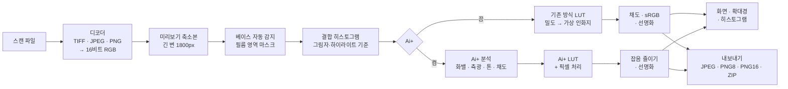
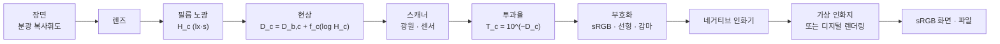

# 🎞️ 네거티브 인화기
 
컬러 네거티브 필름 스캔을 브라우저에서 바로 사진으로 바꾸는, 파일 하나짜리 도구입니다.
설치할 것도, 올릴 곳도 없습니다. `negative-printer.html` 하나를 브라우저로 열면 됩니다.
 
**목차**
 
1. [쉽게 알아보기](#1-쉽게-알아보기)
2. [원리](#2-원리)
3. [작동 방식](#3-작동-방식)
4. [알고리즘과 수식](#4-알고리즘과-수식)
5. [물리 세계](#5-물리-세계)
6. [체계](#6-체계)
7. [이슈와 해결](#7-이슈와-해결)
8. [최적화](#8-최적화)
9. [검증](#9-검증)
10. [특장점](#10-특장점)
11. [한계](#11-한계)
---
 
## 1. 쉽게 알아보기
 
### 이 도구는 무엇인가요
 
필름 카메라로 찍은 컬러 필름을 현상하면, 밝은 곳은 어둡고 어두운 곳은 밝으며 색도 거꾸로 된 주황빛 그림이 나옵니다. 이것을 네거티브라고 부릅니다. 스캐너로 필름을 읽으면 컴퓨터에도 이 뒤집힌 주황빛 그림이 그대로 들어옵니다.
 
네거티브 인화기는 이 그림을 우리가 아는 평범한 사진으로 되돌려 줍니다. 예전에 사진관에서 필름을 종이에 뽑던 일을 브라우저 안에서 하는 셈입니다.
 
### 이런 점이 좋아요
 
- **설치할 것이 없습니다.** 파일 하나를 브라우저로 열면 끝입니다.
- **사진이 밖으로 나가지 않습니다.** 모든 계산을 내 컴퓨터 안에서 하고, 어디에도 올리지 않습니다.
- **알아서 맞춰 줍니다.** 필름의 주황빛, 밝기, 색 균형을 스스로 찾아 맞춥니다.
- **여러 장을 한 번에** 넣고, 한 번에 저장할 수 있습니다.
- **섬세하게 저장합니다.** 스캔에 담긴 고운 색 단계를 그대로 살린 파일로도 저장할 수 있습니다.
### 사용 방법
 
1. `negative-printer.html`을 크롬, 엣지, 사파리, 파이어폭스 같은 브라우저로 엽니다.
2. **스캔 열기**를 누르거나 파일을 화면에 끌어다 놓습니다. 여러 장을 한꺼번에 넣어도 됩니다.
3. 잠시 기다리면 사진으로 바뀐 모습이 나타납니다.
4. 필요하면 자르기, 돌리기, 밝기와 색을 손봅니다. 왼쪽 필름 띠에서 다른 사진을 고를 수 있습니다.
5. **내보내기**로 지금 사진을, **전체 ZIP**으로 모든 사진을 한꺼번에 저장합니다.
N 키를 누르고 있으면 원래 필름 모습을 잠깐 볼 수 있고, 1:1 확대경으로 세부를 살펴볼 수 있습니다.
 
### Ai+ 버튼
 
Ai+를 켜면 필름 사진을 **디지털카메라로 찍은 사진처럼** 다듬어 줍니다. 바랜 곳 없이 맑고, 흰색은 깨끗하고, 색은 살짝 더 산뜻해지며, 필름 특유의 자글자글한 알갱이도 줄어듭니다. 어떤 보정을 했는지는 버튼 아래에 짧게 알려 줍니다.
 
모든 사진에 잘 맞는다고 약속할 수는 없습니다. 마음에 들지 않으면 Ai+를 끄거나, 그 사진만 원래 방식으로 되돌릴 수 있습니다.
 
### 알아 두면 좋은 것
 
필름 가장자리의 주황색 여백이 조금 보이게 스캔하면 색을 더 정확하게 찾습니다. 스캐너가 만든 TIFF, JPEG, PNG 파일을 열 수 있고, 카메라 원본(RAW) 파일은 열지 못합니다. 2억 화소가 넘는 아주 큰 파일은 브라우저 메모리 때문에 열지 못합니다. 인터넷이 없어도 쓸 수 있으며, 그때는 글꼴만 기본 글꼴로 바뀝니다.
 
---
 
## 2. 원리
 
### 2.1 컬러 네거티브 필름은 어떻게 기록하나
 
컬러 네거티브 필름에는 파랑, 초록, 빨강 빛에 각각 반응하는 세 감광층이 있습니다. 빛을 받은 층에서는 현상할 때 그 빛의 보색 염료(노랑, 마젠타, 시안)가 생기고, 빛을 많이 받을수록 염료가 짙어집니다. 그래서 필름에는 밝기와 색이 모두 뒤집힌 그림이 남습니다.
 
실제 염료는 이상적이지 않습니다. 마젠타 염료는 초록빛만 막아야 하지만 파란빛도 조금 막고, 시안 염료는 빨간빛 말고도 초록·파란빛을 조금 막습니다. 이 '원치 않는 흡수'를 상쇄하려고, 필름은 염료가 덜 생긴 곳에 노랑·분홍빛을 띤 마스킹 커플러를 남겨 둡니다. 염료가 생긴 만큼 마스크 색은 사라지므로, 원치 않는 흡수와 마스크를 더하면 노광량과 상관없이 **어디서나 같은 양**이 됩니다. 필름 전체에 깔린 균일한 주황색의 정체가 이것이며, 여기에 필름 베이스와 현상 흐림(포그)의 농도가 더해집니다.
 
### 2.2 밀도와 특성곡선
 
필름이 빛을 얼마나 통과시키는지를 투과율 $`T`$ 로, 얼마나 막는지를 밀도 $`D = -\log_{10} T`$ 로 나타냅니다. 밀도는 로그라서 곱셈이 덧셈이 됩니다. 필름 두 겹을 겹치면 밀도가 더해지고, 노출을 두 배로 늘리면 밀도가 일정량 늘어납니다.
 
노출의 로그에 대한 밀도의 관계를 특성곡선(H&D 곡선)이라 하며, 가운데는 거의 직선이고 양 끝(토와 숄더)은 눕습니다. 직선부의 기울기를 감마 $`\gamma`$ 라 하고, 컬러 네거티브는 보통 0.6 안팎입니다. 장면이 한 스톱(두 배) 밝아지면 밀도는 $`0.6 \times \log_{10} 2 \approx 0.18`$ 만큼 짙어집니다. 그래서 이 도구는 모든 계산을 **밀도, 즉 로그 공간**에서 합니다. 노출 차이는 평행 이동이 되고, 균일한 주황 마스크는 채널마다 더해진 상수가 되어 뺄셈 한 번으로 사라집니다.
 
### 2.3 주황색 빼기와 반전
 
노광되지 않은 필름(베이스)의 투과율을 $`T_b`$ 라 하면, 화상의 각 점을 $`T_b`$ 로 나눈 값 $`T/T_b`$ 에는 마스크와 베이스·포그가 모두 빠진 순수한 화상 밀도만 남습니다. 흔히 쓰는 '색 반전 후 주황색 빼기'는 이 나눗셈을 감마가 걸린 값이나 선형 반전으로 흉내 내는 것이라, 밝기에 따라 다르게 틀어지는 색이 남습니다. 이 도구는 스캔 값을 선형 투과율로 되돌린 뒤 정확히 나눕니다.
 
### 2.4 세 채널의 균형
 
세 감광층의 감마는 서로 조금씩 다르고, 스캐너의 광원과 센서도 채널마다 다릅니다. 그래서 같은 장면 범위가 채널마다 다른 밀도 범위로 기록됩니다. 이 도구는 화상에서 가장 얇은 부분(그림자 기준)과 가장 짙은 부분(하이라이트 기준)을 찾아, 각 채널의 밀도 범위를 0에서 1로 맞춥니다.
 
이때 기준점은 **세 채널이 같은 픽셀 무리**를 보도록 고릅니다. 채널마다 따로 극단값을 고르면, 예를 들어 파란 하늘의 가장 짙은 부분과 흰 벽의 가장 짙은 부분이 섞여 기준 자체의 색이 틀어지기 때문입니다. '채널별' 방식은 층별 감마 차이를 이렇게 보정하고, '연동' 방식은 세 채널에 같은 범위를 써서 필름 고유의 발색을 남깁니다.
 
### 2.5 가상 인화지 (기존 방식)
 
사진관의 인화는 네거티브를 인화지에 비추는 일이고, 인화지에도 S자 모양의 특성곡선과 최대 농도가 있습니다. 기존 방식은 이 인화지를 흉내 냅니다. 정규화한 로그 노출에 인화지 곡선을 걸어 반사율을 얻으므로, 노출과 색온도·색조 슬라이더는 확대기의 노출 시간과 컬러 필터처럼 로그 노출을 옮기는 조작이 됩니다. 결과는 필름을 종이에 뽑은 사진의 느낌입니다.
 
### 2.6 Ai+: 인화지 대신 디지털카메라처럼
 
Ai+는 2.3과 2.4의 필름 해석은 그대로 두고, 마지막 인화지 단계만 **디지털카메라의 렌더링**으로 바꿉니다. 인화지 곡선은 채널마다 따로 걸리기 때문에, 밝은 색(하늘)은 세 채널이 함께 위쪽 어깨로 몰려 색이 바래고, 그림자 색은 채널 차이가 벌어져 지나치게 짙어집니다. 디지털카메라는 밝기에 곡선을 걸고 색의 비율은 지킵니다.
 
Ai+는 여섯 가지 생각으로 이루어집니다. 조명의 색을 추정해 빼는 **화이트밸런스**, 장면의 대표 밝기를 재서 맞추는 **측광**, 밝기에만 거는 **S자 톤 곡선**, 흐린 색을 더 살리는 **바이브런스와 채도 평준화**, 중간 크기 대비를 키우고 그레인을 줄이는 **맑게**, 잡음보다 큰 윤곽만 세우는 **선명화**입니다. 신경망이 아니라 화상 통계에 기반한 계산이며, 모두 브라우저 안에서 합니다.
 
---
 
## 3. 작동 방식
 
### 3.1 전체 흐름
 

 
### 3.2 불러오기
 
TIFF는 자체 디코더로 읽습니다. 8·16비트 정수와 32비트 실수, 무압축·LZW·Deflate·PackBits 압축, 스트립·타일 배치, 청크·플래너 배열을 지원합니다. JPEG와 PNG는 브라우저의 디코더로 읽으므로 8비트입니다. 모든 입력은 채널당 16비트 정수 배열로 통일합니다.
 
원본과 별도로 긴 변 1800px의 미리보기 축소본을 만들어 분석과 화면에 쓰고, 원본 해상도 계산은 1:1 확대경과 저장할 때만 합니다. 원본은 2억 화소까지 받습니다. 16비트 RGB로 약 1.2GB이며, 그보다 크면 브라우저 메모리 한도에 걸립니다.
 
### 3.3 필름과 베이스 찾기
 
**베이스 자동 감지**는 주황색 순서($`R \ge G \ge B`$)를 만족하는 픽셀 가운데 가장 밝은 0.3%(최소 50개)의 평균입니다. 노광되지 않은 필름이 빛을 가장 많이 통과시키기 때문입니다. 스캐너 클리핑(코드값 98.5% 이상)은 제외하며, 주황색 픽셀이 500개와 전체의 2% 중 큰 값보다 적으면 색 조건 없이 다시 찾습니다.
 
**필름 영역 마스크**는 베이스 대비 밀도로 픽셀을 세 종류로 나눕니다.
 
| 종류 | 조건 | 의미 |
|---|---|---|
| 필름 밖 | 클리핑, 평균 밀도가 베이스보다 2.4 이상 짙음, 또는 세 채널 모두 베이스보다 0.03 이상 얇음 | 홀더, 마스크, 필름 사이 빈틈과 퍼포레이션으로 새는 빛 |
| 베이스 같음 | 세 채널 모두 베이스와 ±0.1 이내 | 프레임 사이 여백 (자동 맞춤과 Ai+ 통계에 씀) |
| 화상 | 그 밖 | 통계에 쓰는 픽셀 |
 
마스크에서 필름 테두리를 찾아 통계 영역을 좁히고, 자르기의 자동 맞춤에도 씁니다. 그 안에서 '분석 제외 테두리'(기본 3%)만큼을 한 번 더 뺍니다.
 
### 3.4 그림자·하이라이트 기준 찾기
 
그레인 한 알이 극단값을 정하지 않도록, 먼저 화상 픽셀의 세 채널 평균 로그 투과율을 5×5 이웃으로 평균한 **순위 지도**를 만듭니다. 이 순위로 로그 투과율 −6에서 0까지를 0.001 간격(6,144칸)으로 나눈 **결합 히스토그램**을 쌓되, 칸마다 세 채널의 선형 투과율 합도 함께 누적합니다.
 
가장 얇은 쪽 꼬리(그림자 클리핑, 기본 0.1%)와 가장 짙은 쪽 꼬리(하이라이트 클리핑, 기본 0.1%)에서 필요한 픽셀 수만큼을 모으고, 마지막 칸은 필요한 비율만큼만 더합니다. 그 무리의 채널별 평균 투과율이 그림자 기준과 하이라이트 기준이 됩니다. 통계에서 필름이 아닌 픽셀을 뺐더니 5%도 남지 않으면(베이스 오인 등) 제외 없이 다시 계산합니다.
 
### 3.5 변환표 (LUT)
 
슬라이더를 움직일 때마다 채널마다 65,536칸짜리 변환표를 새로 만듭니다. 칸 번호가 16비트 스캔 값이고, 칸의 내용은 그 값의 최종 선형 출력입니다. 픽셀 처리는 채널당 표 조회 한 번과 몇 번의 곱셈뿐이라, 슬라이더에 즉시 반응합니다.
 
### 3.6 마무리와 저장
 
기존 방식은 표에서 얻은 선형 값에 휘도를 보존하는 채도를 걸고, sRGB로 부호화한 뒤, 밝기에만 언샤프 마스크를 겁니다(기본 양 50%, 원본 기준 반경 1.0px, 노이즈 임계값 1%). 미리보기에서는 반경을 화면 배율에 맞추고, 0.35px보다 작아지면 선명화를 생략합니다.
 
저장은 128행 띠 단위로 합니다. 띠마다 주변을 더 처리한 뒤 잘라내므로, 이웃을 보는 선명화와 잡음 줄이기도 띠 경계에서 이음새 없이 한 번에 처리한 것과 같습니다. 형식은 다음과 같습니다.
 
| 형식 | 방식 |
|---|---|
| JPEG (8비트) | 캔버스 인코더, 품질 0.95 |
| PNG (8비트) | 캔버스 인코더 |
| PNG (16비트) | 자체 인코더 (`CompressionStream`의 Deflate) |
| 전체 ZIP | 자체 ZIP 작성기(무압축 저장), 1.8GB마다 나눔 |
 
파일 이름은 `원래이름_positive.jpg`이고, Ai+를 적용한 프레임은 `원래이름_positive_ai.jpg`입니다. ZIP은 `positives.zip`이며, 나뉘면 `positives_1.zip`, `positives_2.zip`…이 됩니다. Claude의 아티팩트 뷰어 안에서는 다운로드 기능으로 저장 확인 창을 띄우고, 그 밖의 브라우저에서는 일반 다운로드로 저장합니다.
 
### 3.7 편집 도구
 
| 도구 | 동작 |
|---|---|
| ↺ 90° / ↻ 90° / 좌우 반전 | 방향 바꾸기 |
| 자르기 | 손잡이로 변·모서리 끌기, 안쪽 끌어 옮기기. 비율: 자유, 3:2(135, 6×9), 4:3(6×4.5), 1:1(6×6), 5:4(6×7), 65:24(파노라마). 자동 맞춤은 필름 테두리 안쪽에 비율을 맞춰 가운데 정렬 |
| 베이스 찍기 | 찍은 점 7×7 평균을 베이스로 지정하고, 검은점 기준을 '필름 베이스'로 바꿈 |
| 회색 찍기 | 찍은 점 5×5를 무채색으로 만드는 색온도·색조를 계산 |
| 원본 보기 | 버튼이나 N 키(한글 자판의 ㅜ도)를 누르고 있는 동안 스캔 원본을 보여 줌 |
| 1:1 확대경 | 원본 해상도로 처리한 220×220px 영역 |
| 히스토그램 | 결과의 RGB 분포 |
| 보정 초기화 | 보정값만 기본으로. 자르기·회전·반전과 Ai+ 예외는 유지 |
| 모든 프레임에 적용 | 자르기·회전·반전과 Ai+ 예외를 뺀 설정을 모든 프레임에 복사 |
 
설정은 프레임마다 따로 저장됩니다. Esc는 도구를 해제하고, 자르기 중 Enter는 자르기를 마칩니다. 입력 선택지와 슬라이더는 다음과 같습니다.
 
| 항목 | 선택지 또는 범위 | 기본 |
|---|---|---|
| 스캔 인코딩 | sRGB 감마 / 선형(RAW에서 뽑은 선형 TIFF) / 감마 2.2 | sRGB |
| 검은점 기준 | 자동(그림자 백분위) / 필름 베이스(무노광 = 검정) | 자동 |
| 채널 정규화 | 채널별(층별 감마 차이 보정) / 연동(필름 고유 발색 유지) | 채널별 |
| 노출 | −3 … +3 EV | 0 |
| 대비 | 0.5 … 2× | 1 |
| 블랙 포인트 / 화이트 포인트 | −20 … +30% / −30 … +20% | 0 |
| 색온도 / 색조 | −2 … +2 (채널별 인화 노출 스톱) | 0 |
| 채도 | 0 … 200% | 100% |
| 선명도: 양 / 반경 / 노이즈 임계값 | 0 … 300% / 0.4 … 4px / 0 … 5% | 50% / 1.0px / 1% |
| 그림자·하이라이트 클리핑 | 0 … 2% | 0.1% |
| 분석 제외 테두리 | 0 … 20% | 3% |
 
### 3.8 Ai+가 켜졌을 때
 
Ai+는 프레임을 열거나 분석 설정이 바뀔 때 한 번 분석하고(큰 스캔 기준 약 0.25~0.35초), 그 결과로 변환표를 만듭니다. 순서는 다음과 같습니다.
 
1. 기존 방식을 슬라이더 중립으로 만듭니다. 검은점 기준과 채널 정규화는 권장값(자동, 채널별)으로 고정하고, 그 두 선택지는 잠급니다.
2. 정규화한 로그 노출을 선형 빛으로 바꾼 **분석 지도**(긴 변 768px)를 만듭니다. 필름 영역과 분석 설정이 그대로면 다시 쓰고, 바뀌면 새로 만듭니다.
3. 자르기와 테두리 여백 안의 필름 픽셀을 통계 대상으로 고릅니다. 프레임 사이 여백 같은 베이스 픽셀은 빼되, 야경처럼 그런 픽셀이 대부분이면 둡니다.
4. 화이트밸런스, 측광, 톤 곡선, 채도 목표, 국소 대비 지도를 차례로 구합니다.
5. 첫 렌더링 때 원본 해상도 가운데 256×256 블록에서 그레인을 잽니다.
6. 픽셀마다 톤, 색, 국소 대비를 적용하고, 원본 해상도(또는 0.6배 이상 미리보기)에서는 잡음 줄이기와 선명화를 합니다.
Ai+가 켜져 있으면 톤·색 슬라이더는 **Ai+ 결과 위에 더하는 미세 조정**이 됩니다. 모두 0이면 Ai+ 결과 그대로입니다.
 
| 슬라이더 | Ai+에서의 의미 |
|---|---|
| 노출 | 톤 곡선에 들어가기 전 밝기를 스톱 단위로 옮김 |
| 대비 | 곡선의 두 기울기에 곱함 |
| 블랙 포인트 | 베일(β)에 0.015×값을 더함 |
| 화이트 포인트 | 곡선 상한 $`W = 1 - 0.5 \times \text{값}`$ (0.85…1.25) |
| 색온도 / 색조 | Ai+ 화이트밸런스 뒤 채널별 로그 오프셋 |
| 채도 | Ai+가 정한 채도 배율에 곱함 |
| 선명도 | 양 ×1.3, 임계값은 남은 그레인에 맞춰 자동으로 올림 |
 
버튼 아래의 보정 설명은 실제로 한 일만 보여 줍니다. **화밸 보정**(따뜻함 일부 유지), **밝기 ±xEV**(같은 계측 지점의 기존 방식 밝기와 비교), **밝은 장면 유지 / 어두운 장면 유지**(장면 키를 따름), **안개 걷기**, **명암 압축**, **채도 ±x%**, **그레인 줄임**이 있습니다. '이 프레임만 기존 방식으로'를 체크하면 그 프레임만 Ai+를 끕니다.
 
---
 
## 4. 알고리즘과 수식
 
아래 기호에서 $`c \in \{R, G, B\}`$ 는 채널이고, 휘도 가중치는 $`w = (0.2126,\ 0.7152,\ 0.0722)`$ (sRGB/Rec.709)입니다.
 
### 4.1 스캔 값 → 투과율
 
16비트 코드 $`v`$ 를 선형 투과율로 되돌립니다.
 
```math
T = \mathrm{dec}\!\left(\frac{v}{65535}\right),\qquad
\mathrm{dec}_{\mathrm{sRGB}}(u) =
\begin{cases}
u / 12.92 & u \le 0.04045 \\[2pt]
\left(\dfrac{u + 0.055}{1.055}\right)^{2.4} & \text{그 밖}
\end{cases}
```
 
선형 인코딩은 $`\mathrm{dec}(u) = u`$, 감마 2.2는 $`\mathrm{dec}(u) = u^{2.2}`$ 입니다. 로그 투과율 $`\log_{10} T`$ 는 65,536칸 표로 미리 계산해 둡니다.
 
### 4.2 기존 방식
 
**베이스 대비 밀도.** $`T_{b,c}`$ 는 베이스 투과율입니다.
 
```math
D_c = \log_{10} T_{b,c} - \log_{10} T_c
```
 
**기준 밀도.** 3.4의 꼬리 무리의 채널별 평균 투과율을 $`\bar T^{\,\mathrm{dense}}_c`$ (가장 짙은 쪽), $`\bar T^{\,\mathrm{thin}}_c`$ (가장 얇은 쪽)라 합니다.
 
```math
D^{\mathrm{hi}}_c = \log_{10} T_{b,c} - \log_{10} \bar T^{\,\mathrm{dense}}_c,\qquad
D^{\mathrm{lo}}_c =
\begin{cases}
\log_{10} T_{b,c} - \log_{10} \bar T^{\,\mathrm{thin}}_c & \text{자동} \\
0 & \text{필름 베이스}
\end{cases}
```
 
```math
r_c = \max\!\left(D^{\mathrm{hi}}_c - D^{\mathrm{lo}}_c,\ 0.05\right),\qquad
r_c \leftarrow \tfrac{1}{3}\textstyle\sum_k r_k\ \ (\text{연동})
```
 
**장면 범위(스톱).** 필름 감마를 $`\gamma_{\mathrm{film}} = 0.6`$ 로 가정합니다. EV 단위를 환산하는 데만 씁니다.
 
```math
S = \frac{r_G}{\gamma_{\mathrm{film}} \log_{10} 2}
```
 
**정규화 로그 노출과 사용자 조작.** 노출 $`E`$(스톱), 색온도 $`t`$, 색조 $`m`$, 블랙 포인트 $`p_b`$, 화이트 포인트 $`p_w`$ 에 대해 다음과 같습니다.
 
```math
x_c = \left(\frac{D_c - D^{\mathrm{lo}}_c}{r_c} + \frac{k_c + E}{S} - p_b\right)\frac{1}{1 + p_w - p_b},
\qquad
k = \left(t + \tfrac{m}{2},\ -m,\ -t + \tfrac{m}{2}\right)
```
 
색온도 축 $`(1, 0, -1)`$ 과 색조 축 $`(\tfrac12, -1, \tfrac12)`$ 은 둘 다 $`(1,1,1)`$ 과 직교하므로, 색을 바꿔도 전체 밝기는 변하지 않습니다.
 
**가상 인화지.** 최대 농도 $`D_{\max} = 2.4`$, 기울기 $`g = 5 \times \text{대비}`$, 중심 $`x_0 = 0.5`$ 입니다.
 
```math
D_p(x) = \frac{D_{\max}}{1 + e^{\,g (x - x_0)}},\qquad
R(x) = 10^{-D_p(x)},\qquad
y_c = \max\!\left(0,\ \frac{R(x_c) - R(0)}{R(1) - R(0)}\right)
```
 
중간 기울기는 $`D_{\max}\, g / 4 = 3.0`$(정규화 단위당 밀도)입니다. 장면 범위가 8스톱이면 스톱당 약 0.38 밀도이고, 반사율 기준 전체 감마는 약 1.25로 실제 인화의 대비와 비슷합니다.
 
**채도(휘도 보존)와 부호화.** $`s = \text{채도} \times 1.1`$ 입니다.
 
```math
Y = \sum_c w_c\, y_c,\qquad y'_c = Y + s\,(y_c - Y)
```
 
값을 $`[0,1]`$ 로 자른 뒤 sRGB로 부호화합니다.
 
**선명화(언샤프 마스크, 부드러운 문턱).** $`Y'`$ 는 부호화된 휘도, $`G_\sigma`$ 는 가우시안, $`a`$ 는 양, $`\theta`$ 는 노이즈 임계값입니다.
 
```math
d = Y' - G_\sigma * Y',\qquad
d' = a\, d\, \min\!\left(1, \frac{\lvert d\rvert}{\theta}\right),\qquad
c'' = c' + d'
```
 
$`\lvert d\rvert < \theta`$ 인 잔물결은 $`a\,d\lvert d\rvert/\theta`$ 로 약하게만 키워, 그레인이 거칠어지지 않습니다.
 
**회색 스포이트.** 찍은 5×5 영역의 사용자 색 보정 이전 로그 노출(스톱) $`\ell_c`$ 에 대해 다음과 같습니다.
 
```math
o_c = \bar\ell - \ell_c,\qquad
t = \frac{o_R - o_B}{2},\qquad
m = \frac{\tfrac12 o_R - o_G + \tfrac12 o_B}{1.5}
```
 
### 4.3 Ai+
 
**① 선형 빛.** 기존 방식(슬라이더 중립)의 정규화 로그 노출을 선형 빛으로 바꿉니다. 하이라이트 기준이 1, 그림자 기준이 $`2^{-S}`$ 입니다.
 
```math
x_c = \frac{D_c - D^{\mathrm{lo}}_c}{r_c},\qquad e_c = 2^{\,S (x_c - 1)}
```
 
채널별 정규화로 세 채널이 같은 스톱 범위를 갖게 되므로 모두 같은 $`S`$ 를 씁니다. 이는 층마다 감마를 $`\gamma_c = r_c / (S \log_{10} 2)`$ 로 추정해 되돌리는 것과 같습니다.
 
**② 로그와 색도.**
 
```math
\ell_c = \log_2(e_c + \varepsilon),\ \ \varepsilon = 5\times10^{-4},\qquad
\tau = \frac{\ell_R - \ell_B}{2},\qquad
\mu = \frac{\ell_R + \ell_B}{2} - \ell_G
```
 
$`\tau`$ 는 호박색–파랑 축, $`\mu`$ 는 마젠타–초록 축(단위: 스톱)입니다.
 
**③ 조명 추정.** 세 추정의 축별 중앙값으로 $`(\tau_0, \mu_0)`$ 를 정합니다. 밝은 픽셀은 휘도 97.5~99.7% 분위 사이 픽셀의 평균이고, 반사광일 수 있는 최상위 0.3%는 뺍니다. 회색 세계($`p=4`$)와 회색 경계($`p=6`$)는 다음과 같습니다.
 
```math
\hat e_c^{\,\mathrm{SoG}} = \left(\frac1N\sum_i e_{c,i}^{4}\right)^{\!1/4}\quad(Y \le q_{99.5}),
\qquad
\hat e_c^{\,\mathrm{edge}} = \left(\frac1N\sum_i \lVert\nabla e_{c,i}\rVert^{6}\right)^{\!1/6}
```
 
회색 경계는 네 이웃이 모두 통계 픽셀인 곳에서만 중앙 차분으로 잽니다.
 
**④ 불감대와 분위기 보존.**
 
```math
\operatorname{dz}(v, d) = \operatorname{sgn}(v)\max(0, \lvert v\rvert - d),\qquad
\tau_C = \operatorname{dz}(\tau_0, 0.06),\quad \mu_C = \operatorname{dz}(\mu_0, 0.05)
```
 
```math
a =
\begin{cases}
\min\!\big(0.4,\ 0.4\,(\tau_C - 0.2)\big) & \tau_C > 0.2 \\
-\min\!\big(0.1,\ 0.1\,(-\tau_C - 0.2)\big) & \tau_C < -0.2 \\
0 & \text{그 밖}
\end{cases}
```
 
```math
o = \left(\tau' + \tfrac{\mu_C}{3},\ -\tfrac{2\mu_C}{3},\ -\tau' + \tfrac{\mu_C}{3}\right),\quad \tau' = \tau_C - a,
\qquad \tilde\ell_c = \ell_c - o_c
```
 
따뜻한 조명(실내등, 노을)은 틀어짐의 일부를 남기고, 차가운 쪽은 거의 다 고칩니다. 밝기 구간별로 따로 고치지 않는 이유는 7절에 있습니다.
 
**⑤ 측광과 장면 키.** 휘도 로그 $`L_i = \log_2 \sum_c w_c 2^{\tilde\ell_{c,i}}`$ 의 분위수를 $`l_{lo} = q_{0.5}`$, $`l_{hi} = q_{99.5}`$, 중앙값을 $`l_{med}`$ 라 하고, $`DR = l_{hi} - l_{lo}`$ 입니다.
 
```math
\bar\ell = \frac{\sum_i \omega_i L_i}{\sum_i \omega_i},\qquad
\omega_i = \left(0.25 + 0.75\, e^{-\frac{\Delta x_i^2}{2(0.33W)^2} - \frac{\Delta y_i^2}{2(0.33H)^2}}\right) h_i
```
 
```math
h_i =
\begin{cases}
\max\!\big(0.35,\ 1 - 0.3\,(L_i - l_{med} - 1)\big) & L_i > l_{med} + 1 \\
1 & \text{그 밖}
\end{cases}
```
 
평균은 1~99% 분위 안의 픽셀로만 냅니다. 중앙을 더 보고, 중앙값보다 한 스톱 넘게 밝은 곳(하늘)은 스톱마다 가볍게 봅니다.
 
```math
f = \operatorname{clip}\!\left(\frac{2\bar\ell - l_{lo} - l_{hi}}{\max(DR, 4)},\ -0.8,\ 0.8\right),\qquad
f_d = \operatorname{dz}(f, 0.12)
```
 
```math
Y_{\mathrm{key}} = \operatorname{clip}\!\left(0.26 \cdot 4^{\,k f_d},\ 0.05,\ 0.52\right),\qquad
k =
\begin{cases}
1.15 & f_d \ge 0 \\
2.0 & f_d < 0
\end{cases}
```
 
$`\lvert f\rvert \le 0.12`$ 인 보통 장면은 모두 같은 밝기(로그 평균이 선형 0.26, L* 약 58)로 맞추고, 눈밭이나 야경처럼 분명한 장면만 그 키를 따릅니다.
 
**⑥ 두 기울기 톤 곡선.** 키 기준 휘도 $`u = Y / 2^{\bar\ell}`$ 와 $`v = \ln u`$ 에 대해 정의합니다.
 
```math
g(v) = \kappa\left(\ln\!\left(1 + e^{v/\kappa}\right) - \ln 2\right),\quad \kappa = 0.7
```
 
```math
\mathcal L(v) = \operatorname{logit}(Y_{\mathrm{key}}) + n_s\,\big(v - g(v)\big) + n_h\, g(v),\qquad
T(u) = \frac{W}{1 + e^{-\mathcal L(\ln u)}}
```
 
키 아래는 기울기 $`n_s`$, 위는 $`n_h`$ 이고, 약 1스톱 폭에서 매끄럽게 이어집니다. $`\mathcal L`$ 이 $`n_s, n_h`$ 에 선형이므로, 두 목표를 2×2 연립으로 정확히 풉니다.
 
```math
\mathcal L(v_{lo}) = \operatorname{logit}(b_T),\qquad \mathcal L(v_{hi}) = \operatorname{logit}(0.95),\qquad n_s, n_h \in [1.1,\ 1.7]
```
 
```math
v_{lo} = (l_{lo} - \bar\ell)\ln 2,\quad v_{hi} = (l_{hi} - \bar\ell)\ln 2,\qquad
b_T = 0.004 \cdot 2^{\,0.7\,\operatorname{clip}(8 - DR,\ 0,\ 5)}
```
 
$`v_{lo}`$ 는 −0.5 이하, $`v_{hi}`$ 는 0.3 이상으로 제한합니다. 명암 범위가 좁을수록 검은점 목표 $`b_T`$ 를 스톱마다 $`2^{0.7}`$ 배 덜 깊게 잡아, 좁은 장면을 억지로 늘려 그림자 색이 묻히지 않게 합니다. 한쪽 기울기가 범위를 넘으면 그 값에 묶고 다른 쪽을 자기 목표에 다시 맞춥니다.
 
**⑦ 베일 빼기(안개 걷기).** 기울기를 최대로 해도 그림자가 $`b_T`$ 에 닿지 않으면, 곡선이 $`b_T`$ 를 내는 입력 $`x_b`$ 를 이분법으로 찾아 선형 베일 $`\beta`$ 를 뺍니다.
 
```math
\mathcal L(\ln x_b) = \operatorname{logit}(b_T),\qquad
\beta = \operatorname{clip}\!\left(0.6\,\frac{x_{lo} - x_b}{1 - x_b},\ 0,\ \min(0.6,\ 0.8\,x_{lo})\right),\qquad
u' = \frac{u - \beta}{1 - \beta}
```
 
$`x_{lo} = 2^{\,l_{lo} - \bar\ell}`$ 이며, 기울기와 $`\beta`$ 를 번갈아 4번 다시 풉니다.
 
**⑧ 채널 비 보존 적용과 색역 압축.** 채널별 표(LUT)에는 화이트밸런스, 노출, 베일까지 넣은 $`u'_c`$ 를 담습니다. 곡선은 픽셀에서 휘도에 겁니다.
 
```math
Y_u = \sum_c w_c\, u'_c,\qquad t = T(Y_u),\qquad \hat c = u'_c \cdot \frac{t}{Y_u}
```
 
```math
\max_c \hat c > 1 \ \Rightarrow\ \hat c \leftarrow t + (\hat c - t)\,\frac{1 - t}{\max_k \hat c_k - t}
```
 
압축 뒤에도 휘도는 정확히 $`t`$ 로 남고, 채도만 필요한 만큼 줄어듭니다. $`T`$ 는 옥타브마다 256칸인 표로 두고, 픽셀에서는 `float` 비트의 지수·가수로 칸을 바로 찾습니다(로그 계산 없음).
 
**⑨ 채도 평준화와 바이브런스.** 분석 지도에 ⑧까지를 흉내 내어 Lab 채도의 75% 분위 $`C^*_{75}`$ 를 잽니다. 이때 아주 어둡거나($`Y < 0.01`$) 잘린 곳($`\max > 0.97`$)은 뺍니다.
 
```math
\sigma = \operatorname{clip}\!\left(\sqrt{27 / C^*_{75}},\ 0.9,\ 1.25\right)
```
 
픽셀마다 HSV 채도 $`s = (\max - \min)/\max`$ 와 피부 가중치 $`k_s`$ 로 배율을 정합니다. $`R \ge G \ge B`$, $`0.1 < s < 0.75`$, 색상 $`h = (G - B)/(R - B) \in (0.13, 0.75)`$ 일 때 $`k_s = 1 - \lvert h - 0.44\rvert / 0.31`$ 이고, 그 밖은 0입니다.
 
```math
F = \big(1 + 0.2\,(1 - s)^2 (1 - 0.7 k_s)\big)\,\big(1 + (\sigma s_u - 1)(1 - 0.6 k_s)\big)
```
 
$`s_u`$ 는 채도 슬라이더입니다. 거의 회색인 픽셀의 잔여 색을 키우지 않도록, 올리는 쪽($`F > 1`$)에만 무채색 보호를 겁니다.
 
```math
F \leftarrow 1 + (F - 1)\,\operatorname{smoothstep}\!\left(\frac{s - 0.04}{0.10}\right)
```
 
적용은 $`c \leftarrow Y + F (c - Y)`$ 이며, 어느 채널이 $`[0, 1]`$ 을 벗어나면 벗어나지 않는 가장 큰 $`F`$ 로 줄입니다.
 
**⑩ 국소 대비(맑게)와 명암 압축.** 분석 지도에서 출력 휘도의 로그 $`\ell_o`$ 를 가이디드 필터(반경은 지도 긴 변의 2.5%, $`\epsilon = 0.1`$)로 거른 큰 구조를 $`B`$ 라 합니다.
 
```math
\Delta = \operatorname{clip}\!\Big(0.25\,(\ell_o - B) - c_b\,\big(B - \log_2 Y_{\mathrm{key}}\big),\ -1,\ 1\Big),\qquad
c_b = 0.2\,\operatorname{clip}\!\left(\frac{DR - 7}{5},\ 0,\ 1\right)
```
 
픽셀에서는 $`\Delta`$ 를 쌍선형 보간하고, sRGB 부호화된 휘도 $`y'`$ 로 양 끝을 약하게 해 배율 $`2^{\Delta \cdot \min(1,\ 5.2\, y'(1 - y'))}`$ 를 곱합니다(가장 밝은 채널이 1을 넘지 않게 제한). 가이디드 필터는 가장자리를 지키므로 후광이 생기지 않습니다.
 
**⑪ 그레인 측정.** 원본 해상도 가운데 256×256 블록을 ⑧~⑩까지 처리한 뒤, 부호화된 $`Y'`$, $`U = B' - Y'`$, $`V = R' - Y'`$ 각각에 대해 16×16 타일마다 라플라시안의 MAD로 잡음을 잽니다. 독립 잡음이면 라플라시안의 분산이 $`(16 + 4)\sigma^2 = 20\sigma^2`$ 입니다.
 
```math
\hat\sigma_{\mathrm{tile}} = \frac{1.4826\ \operatorname{median}\big\lvert 4 I_{x,y} - I_{x-1,y} - I_{x+1,y} - I_{x,y-1} - I_{x,y+1}\big\rvert}{\sqrt{20}}
```
 
타일 값의 25% 분위(평탄한 쪽)를 $`\sigma_Y`$, 그리고 $`\sigma_C = \max(\sigma_U, \sigma_V)`$ 로 씁니다.
 
**⑫ 잡음 줄이기.** 가이디드 필터(He 등)는 창 $`k`$ 마다 다음을 구해, 출력을 $`\hat p = \bar a\, I + \bar b`$ 로 만듭니다.
 
```math
a_k = \frac{\operatorname{cov}_k(I, p)}{\operatorname{var}_k(I) + \epsilon},\qquad b_k = \bar p_k - a_k \bar I_k
```
 
밝기는 자기 자신을 안내 영상으로($`I = p = Y'`$) 반경 1, $`\epsilon_Y = (2\sigma_Y)^2`$ 로 거른 뒤 60%만 섞습니다. 그레인을 다 지우면 밀랍처럼 보이기 때문입니다.
 
```math
Y'_f = Y' + 0.6\,\big(\mathrm{GF}(Y';\ 1,\ \epsilon_Y) - Y'\big)
```
 
색은 **빠른 가이디드 필터**(He·Sun 2015)를 씁니다. $`Y', U, V`$ 를 2×2 평균한 반해상도에서 반경 1, $`\epsilon_C = (3\sigma_C)^2`$ 로 계수 $`\bar a, \bar b`$ 를 구하고, 이를 원해상도로 쌍선형 보간한 뒤 거르기 전의 원해상도 $`Y'`$ 에 적용합니다. 평탄한 곳은 $`\bar a \approx 0`$ 이라 색이 평균되고, 밝기 윤곽이 있는 곳은 $`\bar a`$ 가 윤곽을 따라가 색이 번지지 않습니다.
 
```math
\hat U = \bar a_U\, Y' + \bar b_U,\quad \hat V = \bar a_V\, Y' + \bar b_V,\qquad
R' = Y'_f + \hat V,\quad B' = Y'_f + \hat U,\quad G' = \frac{Y'_f - 0.2126 R' - 0.0722 B'}{0.7152}
```
 
그레인이 8비트 한 단계 안팎으로 보이지 않을 만큼 작으면($`\sigma_Y \le 0.004`$, $`\sigma_C \le 0.003`$) 그 단계는 건너뜁니다. 미리보기 배율이 0.6보다 작으면 축소로 그레인이 이미 평균되므로 생략합니다.
 
**⑬ 선명화.** 양은 $`1.3 a`$ 입니다. 문턱은 잡음 줄이기 뒤 남은 밝기 잡음의 두 배 아래를 거의 키우지 않도록 올립니다.
 
```math
\theta_{\mathrm{Ai}} = \max\!\big(\theta,\ 2\,\sigma_Y (1 - 0.5 \times 0.6)\big)
```
 
밝기 잡음 줄이기를 건너뛴 경우에는 $`\max(\theta, 2\sigma_Y)`$ 입니다.
 
---
 
## 5. 물리 세계
 
이 도구가 되돌리는 것은 다음 사슬입니다.
 

 
| 단계 | 물리량 | 도구가 쓰는 모델 | 가정과 오차 |
|---|---|---|---|
| 노광 | 노광량 $`H_c`$, 층별 분광 감도 | 로그 노광 $`\log H`$ 가 기본 변수 | 층 사이 분광 겹침(크로스토크)은 모델에 없음 |
| 현상 | 염료 밀도, 특성곡선 | 직선부 $`D = \gamma \log_{10} H + \text{상수}`$, $`\gamma \approx 0.6`$ | 토·숄더는 기준 꼬리와 인화지 곡선이 흡수 |
| 마스크 | 마스킹 커플러, 베이스+포그 | 채널별 상수 밀도 $`D_{b,c}`$ | 마스크 보정이 완벽하다는 가정. 남는 오차는 채널 정규화가 흡수 |
| 스캔 | 스캐너 광원·센서·게인 | $`T_c`$ 에 비례하는 선형 응답, 인코딩만 역변환 | 스캐너의 자동 보정·색 관리가 켜져 있으면 가정이 깨짐 |
| 인화 | 인화지 반사 밀도 | 로지스틱 특성곡선, $`D_{\max} = 2.4`$ | 인화지의 분광 특성은 모델에 없음 |
| 표시 | sRGB | 표준 sRGB 부호화, Rec.709 휘도 | 넓은 색역 화면에서도 sRGB로 보임 |
 
밀도가 로그라는 점이 설계 전체를 받칩니다. 스캐너의 채널 게인 $`k_c`$ 는 $`\log_{10} T_c + \log_{10} k_c`$ 가 되어 베이스로 나눌 때 함께 사라집니다. 장면의 조명 색은 로그 노출의 채널별 평행 이동이 되어 화이트밸런스의 오프셋이 되고, 노출 보정은 전체 평행 이동이 됩니다. Ai+의 선형 빛 $`e_c = 2^{S(x_c - 1)}`$ 은 직선부 가정 아래 노광량 $`H_c`$ 에 비례하는 값을 복원한 것이며, 그 위의 화이트밸런스·측광·톤 곡선은 디지털카메라가 센서의 선형 데이터에 하는 처리와 같은 자리에 놓입니다.
 
---
 
## 6. 체계
 
### 파일과 실행 환경
 
도구 전체가 HTML·CSS·JavaScript를 담은 `negative-printer.html` 파일 하나(약 2,600줄, 143KB)입니다. 외부 라이브러리가 없고, 서버도 필요 없습니다. 글꼴(IBM Plex Sans KR / Condensed)만 Google Fonts에서 받으며, 받지 못하면 시스템 글꼴을 씁니다. GitHub Pages에 올릴 때는 `index.html`로 이름을 바꾸거나 링크하면 됩니다. 16비트 PNG 저장과 Deflate TIFF 읽기에 `CompressionStream`·`DecompressionStream`을 쓰므로 최신 브라우저가 필요합니다. 어두운 화면 설정과 모바일(터치) 화면을 지원합니다.
 
### 구성
 
| 층 | 주요 함수 | 역할 |
|---|---|---|
| 입력 | TIFF 디코더, `createImageBitmap` | 16비트 RGB 배열로 통일, 2억 화소 한도 |
| 필름 해석 | `autoBase`, `filmMask`, `findBorder`, `rankMap`, `analyzeHist`, `percentiles` | 베이스, 필름 영역, 기준 꼬리 |
| 파이프라인 | `buildPipe`(기존), `buildPipeAi`(Ai+) | 채널별 65,536칸 LUT와 매개변수 |
| Ai+ 분석 | `aiAnalyze` 외 | 선형 지도, 화밸, 측광, 곡선 풀이, 채도 목표, 국소 대비 지도 |
| 픽셀 커널 | `render8`(기존 빠른 경로), `aiRect`(Ai+), `processRect`(띠·영역) | 표 조회, 톤·색, 부호화 |
| 후처리 | `aiDenoise`, `unsharp`, `aiGrain` | 잡음 측정·줄이기, 선명화 |
| 출력 | 캔버스 인코더, PNG16 인코더, `ZipWriter` | 저장 |
| 화면 | 필름 띠, 패널, 도구, 확대경, 히스토그램 | 조작과 표시 |
 
### 데이터 흐름과 캐시
 
프레임마다 파일, 이름, 설정, 썸네일을 갖고, 설정은 프레임마다 독립적입니다. 현재 프레임은 원본(16비트), 미리보기(긴 변 1800px), 필름 영역, 기준 꼬리, Ai+ 분석, 파이프라인을 들고 있습니다. 비싼 계산은 입력이 바뀔 때만 다시 합니다. 필름 영역은 베이스와 인코딩이 바뀔 때, 기준 꼬리는 클리핑·테두리·자르기가 바뀔 때, Ai+ 분석 지도는 필름 영역과 기준이 바뀔 때만 다시 만듭니다. 톤·색 슬라이더는 표만 다시 만듭니다. 썸네일은 렌더링이 멈추고 0.7초 뒤 결과 화면에서 만듭니다.
 
### 결정성: 미리보기 = 저장 결과
 
미리보기, 1:1 확대경, 저장은 같은 커널(`processRect`)을 씁니다. 이웃을 보는 처리(선명화, 잡음 줄이기)는 필요한 반경만큼 주변을 더 처리한 뒤 잘라내고, 잡음 줄이기의 반해상도 격자는 처리 영역의 시작을 **전체 화상의 짝수 좌표**에 맞춥니다. 그래서 한 번에 처리한 미리보기와 128행 띠로 나눠 처리한 저장 결과가 비트 단위로 같습니다. 원본 크기의 미리보기에서 PNG8을 저장해 비교하면, 홀수 좌표에서 시작하는 자르기를 포함해 차이가 0입니다.
 
---
 
## 7. 이슈와 해결
 
### 필름 해석과 입출력
 
| 이슈 | 원인 | 해결 |
|---|---|---|
| 흔한 반전 방식의 색 틀어짐 | 감마가 걸린 값에서 반전·감산 | 선형 투과율에서 베이스로 나눔(밀도 공간에서 뺄셈) |
| 홀더·빈틈·퍼포레이션이 통계를 오염 | 필름이 아닌 픽셀이 극단값을 차지 | 베이스 대비 밀도로 필름 밖을 가려냄(짙음 2.4, 얇음 0.03) |
| 스캐너 클리핑 | 포화된 값은 투과율 정보가 없음 | 코드값 98.5% 이상을 분석에서 뺌 |
| 그레인 한 알이 검은점·흰점을 결정 | 단일 픽셀 극단값 | 5×5 평균 순위 지도로 꼬리를 고름 |
| 채널별 독립 백분위의 색 틀어짐 | 채널마다 다른 픽셀이 극단이 됨 | 결합 히스토그램: 같은 픽셀 무리의 채널별 평균 |
| 베이스 오인으로 통계가 텅 빔 | 거의 모든 픽셀이 제외됨 | 5% 미만이 남으면 제외 없이 다시 계산 |
| TIFF LZW 해제 오류 | 코드 폭이 한 칸 일찍 바뀌는 TIFF 방식 | 511·1023·2047에서 코드 폭 증가를 반영 |
| 큰 스캔의 메모리 | 16비트 RGB는 픽셀당 6바이트 | 2억 화소 한도, 미리보기 축소본, 128행 띠 처리 |
| 큰 ZIP | 무압축 ZIP을 메모리에서 만들고, 32비트 ZIP 형식은 4GB가 한계 | 1.8GB마다 나눠 저장 |
 
### Ai+ 설계 과정
 
Ai+는 여러 차례 설계를 바꿨습니다. 아래 수치는 모두 9절의 합성 장면에서 잰 것입니다.
 
| 단계 | 문제 | 원인 | 해결 | 결과 |
|---|---|---|---|---|
| 첫 설계 | 네거티브를 RAW처럼 장면 선형으로 복원하는 방식. 노을(하늘색을 조명색으로 오인), 눈(회색빛), 야경(과밝음)이 알려진 한계 | 목표가 '디지털로 찍은 사진 같은 마감'으로 바뀜 | 폐기하고 기존 방식의 필름 해석을 출발점으로 다시 설계 | — |
| 인화지 출력 위에 채널별 S자 곡선 | 무겁고 탁함, 하늘이 회색, 덤불이 형광 | 곡선을 채널마다 거니 밝은 곳은 채널이 모여 바래고 어두운 곳은 벌어짐 | 휘도에만 곡선, 채널 비 보존, 휘도를 지키는 색역 압축 | 색상 오차 6.6° → 5.3°, 기준 대비 채도 1.27 → 1.10 |
| 인화지 출력 위에 보정 자체 | 하늘이 여전히 회색 | 인화지 곡선이 이미 하늘 색을 바래게 하고(C* 10, 기준 20) 덤불 색을 짙게 함(C* 46, 기준 26). 위에 무엇을 쌓아도 되돌릴 수 없음 | 인화지 이전의 정규화 로그 노출에서 렌더링 | 하늘 C* 10 → 16, 덤불 46 → 38, 색상 오차 5.3° → 4.0° |
| 밝기 구간별 중성축 | 주광의 밝은 회색이 노랗게(b* +10), 형광등의 밝은 회색이 파랗게(b* −13) | 밝은 구간의 대표색(하늘, 베이지 벽)을 무채색으로 오인 | 제거. 기존 방식의 채널 정규화가 이미 밝기별 색을 맞춰 둠. 전체에 한 번만, 불감대 도입 | 주광 b* +4…0, 형광등 +2 |
| 과채도 | 기준 대비 채도 평균 1.27, 장면에 따라 1.42 | 곡선의 채도 상승, 채도 상한, 바이브런스가 겹침 | 채도 목표와 상한 조정 | 1.13 ± 0.07 |
| 회색이 물듦 | 그늘·야경의 회색 패치에 색이 남음 | 바이브런스는 흐린 색일수록 올리므로, 회색의 작은 잔여 색도 키움 | 무채색 보호(HSV 채도 4%에서 14%까지 서서히 적용) | 회색 C* 평균 5.2 → 4.9 |
| 어두운 색이 묻힘 | 보라 패치 L* 16 (표준 컬러 체커 약 30) | 좁은 장면의 검은점 목표가 깊고, 기울기가 상한에 붙음 | 검은점 완화 스톱당 $`2^{0.5} \to 2^{0.7}`$, 기울기 상한 1.8 → 1.7, 중간 밝기 0.24 → 0.26 | 보라 19, 검정 5 → 8, 회색 L* 46.7 → 48.6 |
| 안개가 회색으로 남음 | 흐릿하고 평평함 | 좁은 명암 범위를 기울기만으로 늘릴 수 없음 | 선형 베일 β 빼기 | 안개 장면 L* 표준편차 5.0 → 12.3 |
| 국소 대비의 후광 | 윤곽 주변의 밝은 테 | 흐림 기반 대비 강조는 가장자리를 넘어 번짐 | 가이디드 필터 | 1:1에서 후광 없음 |
| 저장이 느려짐 | 잡음 줄이기가 저장 시간의 62% | 원해상도 박스 필터 14회와 반복 할당 | 8절 참조 | JPEG 10.7 → 7.5초 |
| 반해상도 격자 불일치 위험 | 띠마다 격자 원점이 달라질 수 있음 | 처리 영역 시작 좌표의 홀짝 | 시작을 전체 화상의 짝수 좌표에 맞춤 | 미리보기 = 저장, 차이 0 |
 
---
 
## 8. 최적화
 
| 기법 | 내용 |
|---|---|
| 16비트 LUT | 채널당 65,536칸 표. 픽셀 처리는 표 조회 세 번. 슬라이더 변경은 표만 다시 만듦 |
| 곡선 표의 float 비트 조회 | 옥타브당 256칸 표를 `Float32Array`/`Int32Array` 공유 버퍼의 지수·가수로 바로 찾음. 픽셀마다 `log`·`exp` 없음 |
| 2의 거듭제곱 표 | 국소 대비 배율과 휘도 합산에 $`2^v`$ 표(1/1024, 1/128 간격)와 선형 보간 |
| 축소 분석 | 미리보기 1800px, Ai+ 분석 지도 768px. 지도는 필름 영역과 기준이 같으면 다시 씀 |
| 빠른 경로 | 선명화·잡음 줄이기가 없는 축소 미리보기는 실수 버퍼 없이 바로 8비트 캔버스에 씀 |
| 작은 함수로 나눈 반복문 | JavaScript 엔진이 뜨거운 반복문을 최적화하기 쉽게 분석 단계를 작은 함수로 나눔 |
| 누적합 박스 필터 | 반경과 상관없이 픽셀당 상수 시간. 두 배열을 한 번에 훑는 `boxSum2` |
| 3×3 전용 경로 | 반경 1은 누적합 없이 바로 더함. 1.44MP 띠에서 41 → 26ms (오차 $`5\times10^{-7}`$) |
| 빠른 가이디드 필터 | 색 잡음의 계수를 반해상도에서 구해 계산량을 약 1/4로 |
| 행 캐시 쌍선형 보간 | 반해상도 행마다 가로 보간을 한 번만 해 두고 세로로만 섞음. 픽셀당 16탭 → 8탭 |
| 작업 배열 재사용 | 다 쓴 배열을 다음 단계의 작업 공간으로 씀. 띠마다 새로 할당해 0으로 채우는 양이 약 110MB에서 약 60MB로(추산) |
| 보이지 않는 그레인 건너뛰기 | 8비트 한 단계 안팎의 그레인이면 해당 단계 생략 |
| 띠 처리 | 128행 띠와 주변 여유. 메모리가 원본 크기와 무관하게 일정하고 결과는 한 번에 처리한 것과 같음 |
 
잡음 줄이기 최적화의 누적 효과는 다음과 같습니다. 5640×4160 스캔, 1.44MP 띠 기준입니다.
 
| 측정 | 최적화 전 | 최적화 후 |
|---|---|---|
| 잡음 줄이기 (띠당) | 365ms | 약 180ms |
| 띠 전체 처리 (띠당) | 588ms | 362ms |
| JPEG 저장 (전체) | 10.7초 | 7.5초 |
| PNG16 저장 (전체) | 17.1초 | 13.2초 |
 
---
 
## 9. 검증
 
### 합성 네거티브
 
실제 필름의 정답 사진은 존재하지 않으므로, 정답을 아는 합성 네거티브 15종으로 평가했습니다. 장면(반사율 × 조명, 발광체)을 필름 특성곡선(A형: 층마다 감마 0.55·0.62·0.68, B형: 숄더 있음), 주황 마스크, 그레인, 스캐너 인코딩에 통과시켜 만들었습니다. 정답은 같은 장면을 D65에 순응시켜 sRGB로 그린 것입니다. 장면은 주광, 그늘, 텅스텐, 형광등, 숲, 노을, 안개, 역광, 눈, 야경, 인물, 2스톱 노출 부족·과다, B형 필름의 주광·텅스텐입니다. 모든 장면에 24색 컬러 체커를 두었습니다.
 
### 화질 (보통 장면 9종)
 
보통 장면은 주광, 그늘, 텅스텐, 형광등, 인물, 2스톱 노출 부족·과다, B형 필름의 주광·텅스텐 9종입니다. 숲, 노을, 안개, 역광, 눈, 야경은 장면 자체가 특수해 따로 봤습니다.
 
| 지표 | 기존 방식 | Ai+ |
|---|---|---|
| 색상 오차 (유채색 패치 평균) | 5.7° | **4.1°** |
| 기준 대비 채도 | 1.11 ± 0.09 | **1.13 ± 0.07** |
| 평균 밝기 L* (장면 간 편차) | 63.1 ± 9.7 | **59.3 ± 4.6** |
| 중간 회색 패치 L* | 54.4 ± 10.9 | **48.6 ± 5.5** |
| 대비 (L* 표준편차) | 18.3 | **21.9** |
| 평탄한 패치의 잡음 (8비트 표준편차) | 1.40 | **0.99** |
| 회색 패치 C* 평균 (최대) | 3.9 (11.8) | 4.9 (13.4) |
 
15종 전체로는 평균 L*가 60.2 ± 19.3에서 57.8 ± 9.0으로, 흰색 클리핑이 6.6%에서 5.5%로 바뀝니다. Ai+의 흰색 클리핑은 대부분 밝은 파란 하늘의 파랑 채널, 노을의 태양 주변, 역광의 하늘처럼 디지털 사진에서도 포화되는 곳입니다.
 
### 회귀와 기능
 
| 검사 | 결과 |
|---|---|
| Ai+를 끈 기존 방식 출력 | Ai+ 도입 이전 판과 비트 단위로 같음 |
| 미리보기 = PNG8 저장 (잡음 줄이기 포함, 홀수 좌표 자르기 포함) | 차이 0 |
| PNG16 ≫ 8 = PNG8 | 차이 0 |
| 회전·반전 왕복 | 픽셀 동일, 자르기 복원 오차 $`4\times10^{-17}`$ |
| 자르기 손잡이, 비율, 자동 맞춤, 스포이트, ZIP 무결성 | 통과 |
| 1:1 국소 대비 후광 | 없음 |
| 툴팁·화면 낭독 문구, 상태 전환(켬, 끔, 프레임 예외) | 통과 |
 
### 성능
 
5640×4160 16비트 TIFF, 리눅스 컨테이너의 헤드리스 Chromium에서 잰 값입니다. 기기에 따라 다릅니다.
 
| 작업 | 기존 방식 | Ai+ |
|---|---|---|
| 불러오기 + 분석 + 첫 렌더 | 1.22초 | 2.27초 |
| 슬라이더 한 번 (미리보기 렌더) | 약 60ms | 약 250~390ms |
| Ai+ 분석 (지도 새로 / 재사용) | — | 354ms / 238ms |
| JPEG 저장 | 3.2초 | 7.5초 |
| PNG16 저장 | 10.7초 | 13.2초 |
| JS 힙 | — | 286MB |
 
Ai+의 저장이 느린 것은 원본 해상도에서 하는 잡음 줄이기 때문입니다.
 
---
 
## 10. 특장점
 
**물리에 기반한 변환.** 선형 투과율을 베이스로 나누고 밀도 공간에서 계산하므로, 주황 마스크가 밝기에 따라 다르게 남지 않습니다. 슬라이더는 확대기의 노출과 컬러 필터처럼 로그 노출을 옮기는 조작이라 결과를 예측하기 쉽습니다.
 
**처음부터 끝까지 16비트.** 16비트 입력을 16비트 표로 처리하고, 16비트 PNG로 저장할 수 있습니다. 계조가 끊기지 않고, 다른 편집 프로그램에서 더 손볼 여유가 남습니다.
 
**자동화.** 베이스, 필름 영역, 검은점·흰점, 자르기 자동 맞춤을 스스로 찾습니다. Ai+는 화이트밸런스, 밝기, 대비, 채도, 그레인까지 장면마다 맞춥니다.
 
**투명한 Ai+.** 신경망이 아닌 통계 계산이라 무엇을 했는지 설명할 수 있고, 실제로 한 보정을 화면에 적어 줍니다. 슬라이더는 Ai+ 위의 미세 조정으로 계속 작동하며, 프레임마다 끌 수 있습니다.
 
**미리보기와 저장이 같습니다.** 같은 커널, 주변 여유, 짝수 격자 정렬 덕분에 화면에서 본 것이 비트 단위로 그대로 저장됩니다.
 
**사생활과 휴대성.** 서버도 설치도 없고 사진이 기기 밖으로 나가지 않습니다. 파일 하나라 보관하고 옮기기 쉽고, 인터넷 없이도 작동합니다.
 
**여러 장 작업.** 필름 띠, 프레임별 설정, 모든 프레임에 적용, 전체 ZIP 저장을 지원합니다.
 
**사용성.** 어두운 화면과 모바일 화면, 키보드 조작(N, Esc, Enter), 툴팁과 화면 낭독용 설명을 갖췄습니다.
 
---
 
## 11. 한계
 
**지원하지 않는 입력.** 카메라 RAW(DNG, ARW, RAF 등), BigTIFF, JPEG 압축 TIFF, YCbCr TIFF, 흑백·RGB가 아닌 색 형식은 읽지 못합니다. JPEG·PNG 입력은 8비트라 계조가 부족할 수 있습니다. 원본은 2억 화소까지 받습니다.
 
**검증 범위.** 모든 정량 평가는 합성 네거티브에서 했습니다. 실제 필름은 감광층 사이의 분광 겹침, 비선형 특성곡선, 스캐너의 자체 보정 때문에 결과가 다를 수 있고, 매개변수 조정이 필요할 수 있습니다. 스캐너의 자동 노출·색 보정은 끄고 스캔하는 것이 좋습니다.
 
**Ai+의 알려진 한계.** 텅스텐 조명 장면은 따뜻하게 남습니다(회색 패치 b* 약 +13, 기존 방식과 비슷). 기존 방식이 이미 밝은 등을 흰색으로 맞춰 놓아, 남은 따뜻함이 조명 색인지 벽 색인지 통계로 가를 수 없기 때문입니다. 야경의 회색도 따뜻하게 나오고, 눈은 밝지만 순백은 아니며, 잎처럼 결이 많은 장면은 그레인을 크게 재서 잡음 줄이기가 세질 수 있습니다. 5640×4160 스캔의 저장은 기존 방식보다 2.5~4.3초 느립니다.
 
**색 관리.** 출력은 sRGB 기준입니다. 16비트 PNG에는 sRGB 청크를 넣고, ICC 프로필은 넣지 않습니다.
 
