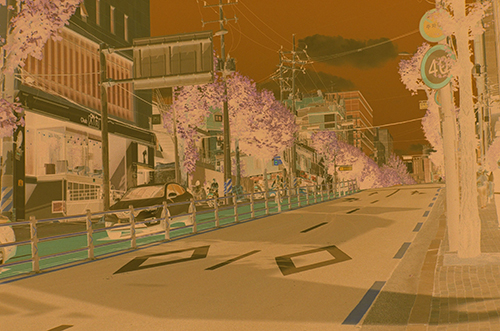
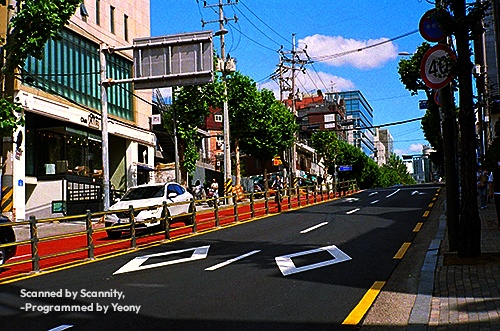
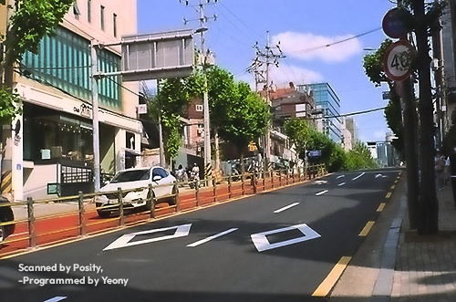

# 🎞️ Posity

디시인사이드 유저는 사용을 금하며, 이는 라이선스로, 법적 효력을 갖습니다.
위반 시, 디시인사이드 내 IP와 비교하여 법적 형사 고소를 가할 것입니다.

컬러 네거티브 필름 스캔을 브라우저에서 바로 사진으로 바꾸는, 파일 하나짜리 도구입니다.
설치할 것도, 올릴 곳도 없습니다. `posity.html` 하나를 브라우저로 열면 됩니다.

<https://scan.yeon.at/posity.html>

현재 버전 **v2.10.0** · 사용법과 원리·수식·검증은 [도움말 페이지](https://scan.yeon.at/information.html)에, 바뀐 점은 [3. 변경 기록](#3-변경-기록)에 있습니다. 도구 화면 왼쪽 위 제목 옆에도 버전이 표시됩니다. v2.8.3까지의 이름은 '네거티브 인화기', v2.9.0까지의 파일 이름은 `negative-printer.html`이었고, 예전 주소로 들어오면 새 주소로 넘어갑니다.

**목차**

1. [쉽게 알아보기](#1-쉽게-알아보기)
2. [도움말과 분석 정보](#2-도움말과-분석-정보)
3. [변경 기록](#3-변경-기록)

---

## 1. 쉽게 알아보기

### 이 도구는 무엇인가요

필름 카메라로 찍은 컬러 필름을 현상하면, 밝은 곳은 어둡고 어두운 곳은 밝으며 색도 거꾸로 된 주황빛 그림이 나옵니다. 이것을 네거티브라고 부릅니다. 스캐너로 필름을 읽으면 컴퓨터에도 이 뒤집힌 주황빛 그림이 그대로 들어옵니다.

Posity는 이 그림을 우리가 아는 평범한 사진으로 되돌려 줍니다. 예전에 사진관에서 필름을 종이에 뽑던 일을 브라우저 안에서 하는 셈입니다.

### 이런 점이 좋아요

- **설치할 것이 없습니다.** 파일 하나를 브라우저로 열면 끝입니다.
- **사진이 밖으로 나가지 않습니다.** 모든 계산을 내 컴퓨터 안에서 하고, 어디에도 올리지 않습니다.
- **알아서 맞춰 줍니다.** 필름의 주황빛, 밝기, 색 균형을 스스로 찾아 맞춥니다.
- **여러 장을 한 번에** 넣고, 한 번에 저장할 수 있습니다.
- **섬세하게 저장합니다.** 스캔에 담긴 고운 색 단계를 그대로 살린 파일로도 저장할 수 있습니다.

### 사용 방법

1. `posity.html`을 크롬, 엣지, 사파리, 파이어폭스 같은 브라우저로 엽니다.
2. **스캔 열기**를 누르거나 파일을 화면에 끌어다 놓습니다. 여러 장을 한꺼번에 넣어도 되고, 폴더를 통째로 끌어다 놓으면 안쪽(하위 폴더 포함)의 이미지를 모두 넣습니다. 이미 넣은 파일은 다시 넣어도 건너뜁니다.
3. 잠시 기다리면 사진으로 바뀐 모습이 나타납니다.
4. 필요하면 자르기, 돌리기, 밝기와 색을 손봅니다. 왼쪽 필름 띠에서 다른 사진을 고르거나 ← → 키로 넘길 수 있습니다. 필름 띠의 썸네일은 파일을 넣으면 뒤에서 한 장씩 변환해 채워집니다. 필요 없는 컷은 썸네일 오른쪽 위의 × 로 목록에서 뺄 수 있고, 알림의 **되돌리기**로 다시 넣습니다.
5. **내보내기**로 지금 사진을, **전체 ZIP**으로 모든 사진을 한꺼번에 저장합니다. 저장한 사진의 왼쪽 아래, 가장자리에서 조금 안쪽에 "Scanned by Posity, -Programmed by Yeony" 워터마크가 두 줄로 새겨지고, 화면에서도 같은 자리에 보입니다. 전체 ZIP은 도중에 **취소**하면 그때까지 변환한 사진만 담아 저장합니다. Ai+ 켜짐, 저장 형식, JPEG 품질은 다음에 열 때도 그대로입니다.

N 키를 누르고 있으면 원래 필름 모습을 잠깐 볼 수 있고, 1:1 확대경으로 세부를 살펴볼 수 있습니다.

### Ai+ 버튼

Ai+를 켜면 필름 사진을 **디지털카메라로 찍은 사진처럼** 다듬어 줍니다. 바랜 곳 없이 맑고, 흰색은 깨끗하고, 색은 살짝 더 산뜻해지며, 필름 특유의 자글자글한 알갱이도 줄어듭니다. 어떤 보정을 했는지는 버튼 아래에 짧게 알려 줍니다.

모든 사진에 잘 맞는다고 약속할 수는 없습니다. 마음에 들지 않으면 Ai+를 끄거나, 그 사진만 원래 방식으로 되돌릴 수 있습니다.

### 예시

벚꽃이 핀 맑은 날의 거리를 찍은 컬러 네거티브 스캔입니다(500 × 331 px, 8비트 JPEG). 아무 설정도 건드리지 않고 파일만 넣어 두 방식으로 변환했습니다(v2.10.0, 왼쪽 아래는 워터마크).

스캔한 네거티브 원본. 필름 바탕의 주황빛(마스크)이 전체에 깔려 있습니다.

| 기본 방식 | Ai+ |
|:---:|:---:|
|  |  |

**기본 방식**은 사진관 인화지처럼 대비가 강하고 쨍합니다. 하늘은 짙은 파랑이고, 붉은 자전거 도로와 초록 가로수가 선명합니다. 그 대신 가장 어두운 곳과 가장 밝은 곳이 잘려, 햇빛 받은 아스팔트와 그늘이 거의 까맣게 뭉개지고 흰 건물 벽 일부가 하얗게 날아갔습니다.

**Ai+**는 버튼 아래에 "보정 · 밝기 +1.7EV · 채도 +39% · 그레인 줄임"이라고 알려 줍니다. 아스팔트나 보도 같은 회색이 이미 치우침 없이 회색이라 색은 고치지 않았고, 기본 방식이 너무 어둡게 누른 중간 밝기를 1.7스톱 올렸으며, 스캔의 옅은 색에 채도를 더하고 필름 알갱이를 줄였습니다. 그래서 아스팔트의 결, 그늘 속 보도블록, 흰 차의 모양이 살아 있으면서도 그림자는 충분히 짙고, 까맣게 뭉개진 곳은 거의 없습니다(기본 방식 19%, Ai+ 1%). 하늘은 기본 방식보다 조금 밝고 연한 파랑입니다.

어느 쪽이 정답이라기보다 쓰임새의 차이입니다. 강하고 쨍한 인화 느낌이 좋으면 기본 방식을, 그늘과 밝은 곳의 세부까지 남긴 디지털 사진 같은 결과가 좋으면 Ai+를 쓰세요. 두 방식 모두 슬라이더로 다듬을 수 있습니다. Ai+에서 **블랙 포인트**를 올리면 그림자가 더 깊어지고, 기본 방식에서는 **노출**을 +0.9 EV쯤 올리면 이 사진의 뭉개진 그늘이 살아납니다. 이 예시의 측정값은 [도움말의 '실제 스캔 예시'](https://scan.yeon.at/information.html#s4-6-real)에 있습니다.

### 알아 두면 좋은 것

필름 가장자리의 주황색 여백이 조금 보이게 스캔하면 색을 더 정확하게 찾습니다. 스캐너가 만든 TIFF, JPEG, PNG 파일을 열 수 있고, 카메라 원본(RAW) 파일은 열지 못합니다. 2억 화소가 넘는 아주 큰 파일은 브라우저 메모리 때문에 열지 못합니다. 인터넷이 없어도 쓸 수 있으며, 그때는 글꼴만 기본 글꼴로 바뀝니다.

---

## 2. 도움말과 분석 정보

사용법과 그 뒤에서 일어나는 계산은 [도움말 페이지](https://scan.yeon.at/information.html)에 모아 두었습니다. 도구 머리줄의 **도움말** 버튼이나 <kbd>?</kbd> 키로도 열 수 있습니다.

- [1부 시작하기](https://scan.yeon.at/information.html#part-1) — 처음 쓰는 순서, 화면 구성, Ai+ 보정 문구의 뜻, 단축키, 저장과 워터마크, 문제 해결
- [2부 원리](https://scan.yeon.at/information.html#part-2) — 컬러 네거티브가 빛을 기록하는 방식과, Posity가 그것을 되돌리는 원리
- [3부 작동 방식](https://scan.yeon.at/information.html#part-3) — 불러오기부터 베이스 찾기, 변환표, 저장까지의 흐름
- [4부 분석 정보](https://scan.yeon.at/information.html#part-4) — 알고리즘과 수식, 물리 세계, 체계, 설계에서 풀어 온 문제, 최적화, 검증, 특장점, 한계, 참고 문헌
- [부록 용어 풀이](https://scan.yeon.at/information.html#glossary)

---

## 3. 변경 기록

버전 번호는 v2.7.0부터 도구 화면에 표시됩니다. 기존 방식(Ai+ 끔)의 출력은 v1.0.0부터 지금까지 비트 단위로 같습니다.

### v2.10.0 — 도움말 페이지

- 사용법과 분석 정보를 한곳에 모은 [도움말 페이지](https://scan.yeon.at/information.html)(`information.html`)가 생겼습니다. 1부 시작하기(처음 쓰는 순서, 화면 구성, Ai+ 보정 문구의 뜻, 단축키, 저장과 워터마크, 문제 해결), 2부 원리, 3부 작동 방식, 4부 분석 정보(알고리즘과 수식, 물리 세계, 체계, 설계에서 풀어 온 문제, 최적화, 검증, 특장점, 한계, 참고 문헌), 부록 용어 풀이로 이루어집니다.
- 도움말은 수식을 그려서 보여 주고, 목차 찾기, 지금 읽는 절 표시, 어두운 화면과 모바일 화면을 지원합니다.
- 도구 머리줄의 **도움말** 버튼, <kbd>?</kbd> 키, 빈 화면의 안내, 변환 원리·Ai+ 원리 요약에서 도움말로 이어집니다. 도움말은 새 탭으로 열려 작업 중인 화면을 떠나지 않습니다.
- 원리·작동 방식·수식·검증 같은 자세한 내용은 이제 도움말 페이지에서 볼 수 있습니다.
- 도구의 Ai+ 원리 요약에서 색역 처리 설명을 지금 동작(밝기와 색을 반씩 지킴)에 맞게 고쳤습니다. 변환 결과는 v2.9.1과 같습니다.

### v2.9.1 — 파일 이름도 Posity로

- 도구 파일 이름을 `negative-printer.html`에서 `posity.html`로 바꿨습니다. 사이트 주소도 `scan.yeon.at/posity.html`이 됩니다.
- 예전 주소가 깨지지 않도록, 같은 자리에 작은 안내 페이지 `negative-printer.html`을 남겼습니다. 들어오면 곧바로 `posity.html`로 넘어가고(주소 뒤 `?`·`#` 유지, 뒤로 가기 기록에 남지 않음), 스크립트가 꺼져 있어도 meta refresh와 링크로 이동합니다. 검색에는 새 주소만 잡히도록 표시해 두었습니다.
- 도구의 동작과 변환 결과는 v2.9.0과 같습니다.

### v2.9.0 — 이름을 Posity로

- 프로그램 이름을 '네거티브 인화기'에서 **Posity**로 바꿨습니다. 도구 제목과 브라우저 탭 제목이 새 이름을 씁니다.
- 워터마크 첫 줄을 "Scanned by Scannity,"에서 "Scanned by Posity,"로 바꿨습니다. 워터마크 글꼴 파일에 담는 글자도 새 문구에 맞췄습니다(소문자 s 추가).
- 저장해 두는 설정(Ai+ 켜짐, 저장 형식, JPEG 품질)의 열쇠 이름도 바꾸되, 예전 이름으로 저장된 설정을 그대로 읽어 와 다시 고를 필요가 없습니다.
- 이 판까지는 파일 이름이 `negative-printer.html`이었습니다(v2.9.1에서 `posity.html`로 바꿈).
- 변환 결과는 워터마크 문구 말고는 v2.8.3과 같습니다.

### v2.8.3 — 워터마크 자리와 크기

- 가장자리에서 짧은 변의 6% 안쪽으로 옮겼습니다(v2.8.2는 5%). 5640×4160 스캔이면 왼쪽·아래에서 약 250px 안쪽입니다.
- 글자를 짧은 변의 2.2% → 2.5%로 조금 키웠습니다(같은 스캔에서 약 92px → 104px, 최소 10 → 11px).

### v2.8.2 — 워터마크 글꼴과 위치

- 워터마크 글꼴을 Outfit 굵은체(700, 기하학적인 산세리프)로 바꿨습니다. 워터마크에 쓰는 글자만 담은 작은 파일을 Google Fonts에서 받고, 받지 못하면 시스템의 굵은 산세리프로 그립니다.
- 가장자리에서 짧은 변의 5% 안쪽에 둡니다(v2.8.1은 6%). 5640×4160 스캔이면 글자 약 92px, 왼쪽·아래에서 약 208px 안쪽입니다.

### v2.8.1 — 워터마크 다듬기

- 워터마크를 가장자리에서 짧은 변의 4.5% → 6% 안쪽으로 옮겼습니다.
- 글꼴을 Playfair Display 굵은(700) 기울임체로 바꿨습니다. 워터마크에 쓰는 글자만 담은 작은 파일로 받고, 받지 못하면 시스템의 굵은 기울임 세리프로 그립니다.

### v2.8.0 — 워터마크

- 모든 저장 결과(JPEG, PNG8, PNG16, 전체 ZIP)의 왼쪽 아래에 "Scanned by Scannity," / "-Programmed by Yeony" 두 줄을 새깁니다. 자르기·회전 뒤의 최종 화상에 새기므로 도구의 자르기로 지울 수 없고, 가장자리에서 짧은 변의 4.5%만큼 안쪽에 둡니다. 크기는 짧은 변의 2.2%입니다.
- 화면에도 같은 자리·같은 비율로 보여 저장 결과를 미리 알 수 있습니다. 자르는 중에는 자르기 사각형 안쪽에 보입니다.
- 워터마크 자리를 뺀 변환 결과는 v2.7.1과 같습니다.

### v2.7.1 — 기기 어두운 모드 따르기

- 기기가 어두운 모드이면 언제나 어두운 테마를 씁니다. 전에는 이 페이지를 안에 넣어 보여 주는 화면이 밝은 테마를 지정하면 기기가 어두워도 밝게 남았습니다. 기기가 밝은 모드일 때 감싼 화면이 어두운 테마를 지정하면 그대로 어둡게 따릅니다.
- `color-scheme`을 선언해 선택 상자 목록, 체크박스, 스크롤 막대 같은 브라우저 기본 부품도 어두운 모드에서 어둡게 그립니다. 전에는 이 부품들이 어두운 화면에서도 밝게 남았습니다.
- 변환 결과(픽셀)는 v2.7.0과 같습니다.

### v2.7.0 — 실제 스캔 검증 반영

처음으로 실제 네거티브 스캔(맑은 날의 거리, [예시](#예시))을 넣어 두 방식을 검증하고, 드러난 문제를 고쳤습니다. 측정값은 도움말의 [실제 스캔 예시](https://scan.yeon.at/information.html#s4-6-real)에 있습니다.

- **Ai+ 검은점**: 명암 범위가 좁으면 검은점을 올려 잡는 규칙의 기준을 8스톱에서 6스톱으로 낮추고, 그림자 쪽 곡선 기울기 상한을 1.7에서 2.0으로 올렸습니다. 실제 스캔에서 가장 어두운 1%가 L* 12 → 7로 내려가 옅어 보이던 것이 사라졌습니다. 안개처럼 정말 흐린 장면은 그대로 부드럽게 남습니다.
- **Ai+ 밝고 선명한 색**: 색역을 넘는 색(밝은 파란 하늘 등)을 휘도 유지와 색도 유지를 반씩 섞어 처리합니다. 하늘 C* 27 → 36. 흰색에 가까운 곳은 휘도 유지만 써서 잘린 하이라이트는 흰색으로 날아갑니다.
- **Ai+ 채도 상한**: 맑은 장면(명암 범위 6스톱 이상)은 채도 배율 상한을 1.3에서 1.4로 올려, 채도가 옅게 스캔된 필름도 살립니다. 흐린 장면은 1.3 그대로입니다. 실제 스캔 평균 C* 11.6 → 13.5.
- **버전 표시**: 도구 제목 옆에 버전을 보여 줍니다.
- **코드 정리**: 쓰이지 않던 함수 2개를 지우고, 채도 통계를 내는 분석용 톤 함수를 화면 처리와 같은 색역 처리로 맞췄습니다.
- **검증 추가**: 컬러 체커 18색의 색상·채도·명도를 두 방식 모두 패치별로 재서 도움말의 [검증](https://scan.yeon.at/information.html#s4-6-3)에 실었습니다.
- **시도했지만 넣지 않은 것**: 기존 방식의 자동 인화 노출(안개·눈·야경을 망침), 화이트밸런스의 마젠타–초록 밝기 기울기(구름 색에 효과 없음). 자세한 내용은 도움말의 [설계에서 풀어 온 문제](https://scan.yeon.at/information.html#s4-4)에 있습니다.
- **달라지는 점**: 명암 범위가 원래 좁은 장면에서는 그림자가 전보다 짙습니다(합성 주광의 체커 검정 L* 8 → 3). 합성 22장면의 흰색 클리핑은 7.7% → 9.6%(대부분 하늘), 잡음은 0.77 → 0.88로 조금 늘었습니다.

### v2.6.0 — 검토 20항목

- 버그: '모든 프레임에 적용' 뒤 썸네일 갱신, 파일 추가 뒤 적용 버튼 상태, 썸네일 갱신 때 키보드 포커스 유지, 회전 실패 시 화면 잠김, 예기치 못한 오류 알림, Ai+의 블랙 포인트 슬라이더가 사실상 무효이던 것(이제 그림자 깊이를 조절).
- 기능: 목록에서 빼기와 되돌리기, 전체 ZIP 취소, ← → Home End로 프레임 이동, 폴더 끌어다 놓기, 중복 파일 건너뛰기, JPEG 품질 선택(92 / 95 / 100), Ai+·형식·품질 기억, 편집 뒤 새로고침 확인, 읽을 수 없는 파일 표시와 이유, 화밸 보정량을 색온도·색조 슬라이더 단위로 표시.
- Ai+ 야경을 덜 밝게(평균 L* 32 → 25).

### v2.5.0 — 썸네일이 조작을 방해하지 않게

- 조작이 1.2초 멈췄을 때만 썸네일을 만들고, 해독·축소·분석을 잘게 나눠 사이마다 쉼. 조작 중 최대 멈춤 0.5초 → 0.1초.
- 무압축 16비트 TIFF를 복사 없이 읽음, 화밸 후보 정렬을 계수 정렬로(71 → 28ms).

### v2.4.0 — 필름 띠 썸네일

- 열지 않은 프레임의 썸네일을 뒤에서 한 장씩 만듦('미리보기 없음' 해결).

### v2.3.0 — 디지털 사진 마감 강화

- 그레인 측정을 5×5 고역 분산(다섯 블록)으로, 밝기 잡음 줄이기 반경 2·75%, 색 잡음 반경 3, 선명화 1.5배, 중간 톤 곡선 기울기 하한.

### v2.2.0 — 물 빠짐 1차 수정

- 밝은 쪽 곡선 기울기 상한을 따로 2.0으로, 채도 목표 30·하한 1.0, 바이브런스 0.25, 국소 대비 0.3.

### v2.1.0 — 화이트밸런스 재설계

- 밝기 구간별 중성 후보 합의(초록 캐스트 보고에 따라). 필름 층별 특성곡선 차이(크로스오버)로 생기는 중간 톤 캐스트까지 보정.

### v2.0.0 — Ai+ 디지털 사진 마감

- Ai+를 '디지털카메라로 찍은 사진처럼'으로 다시 설계. 기존 방식의 필름 해석 위에 휘도 톤 곡선, 채도 평준화, 국소 대비, 잡음 줄이기.

### v1.1.0 — Ai+ 첫 설계 (폐기)

- 네거티브를 RAW처럼 장면 선형으로 복원하는 방식. v2.0.0에서 교체.

### v1.0.0 — 기존 방식

- 베이스 자동 감지, 채널별 정규화, 가상 인화지, 16비트 처리, TIFF 해독기, 자르기·회전, 전체 ZIP 저장.
